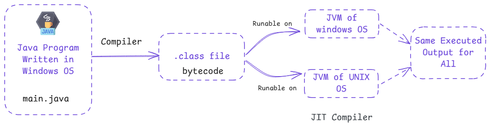

# Introduction to Java

  

## What is Programming?

Programming is writing instructions that a computer can understand to perform specific tasks. These instructions, known as code, are written using programming languages. You can create software, websites, games, and more with programming. It’s how we communicate with computers to solve problems and build amazing technologies.

## Brief History of Java

Java was created by James Gosling and his team at Sun Microsystems in 1995. Initially, it was designed for interactive television, but it quickly became a general-purpose programming language. The team named it “Java” after their favorite coffee! In 2010, Oracle acquired Sun Microsystems and continued developing Java. Over the years, Java has grown into one of the most widely used programming languages, powering millions of applications worldwide.

## What is Java?

Java is a versatile, object-oriented programming language used for building all kinds of software, from mobile apps and websites to enterprise-level applications. Its biggest strength is its platform independence, meaning a program written in Java can run on any device or operating system that supports the Java Virtual Machine (JVM). This makes Java a "write once, run anywhere" language.

## Key Features of Java

- **Simple**: Easy to learn and use, with a clean and straightforward syntax.
- **Platform Independent**: Java programs can run on any device with a JVM.
- **Object-Oriented**: Follows principles like classes and objects for modular, reusable code.
- **Secure**: Java includes built-in security features to protect applications from threats.
- **Robust**: Designed to handle errors effectively and provide a stable runtime.
- **Multithreaded**: Allows multiple tasks to run at the same time for better performance.
- **Scalable**: Used for both small programs and large, enterprise-level systems.
- **Extensive Libraries**: Comes with a wide range of pre-built tools to speed up development.
