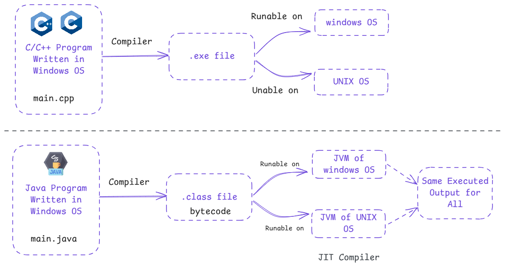

# Java vs C++

  

Java and C++ are two popular programming languages, but they differ in several ways:

## 1. Platform Independence

- **C++**: Creates machine-specific `.exe` files, so programs run only on the operating system they were compiled for (e.g., Windows).
- **Java**: Generates bytecode (`.class` files), which can run on any system with a Java Virtual Machine (JVM), making it platform-independent.

## 2. Compilation and Execution

- **C++**: Compiled directly into machine code.
- **Java**: Compiled into bytecode, which is interpreted by the JVM at runtime.

## 3. Memory Management

- **C++**: Offers manual memory management using pointers and dynamic allocation.
- **Java**: Handles memory automatically using garbage collection, reducing the chance of memory leaks.

## 4. Complexity

- **C++**: Allows low-level operations like working with pointers and direct memory manipulation, which makes it more complex.
- **Java**: Focuses on simplicity and safety, with no direct pointer support.

## 5. Application Type

- **C++**: Used for system programming, games, and applications requiring high performance.
- **Java**: Preferred for web, mobile, and enterprise applications due to its portability and robust libraries.

## Summary

In summary, C++ gives more control and performance, while Java prioritizes simplicity and platform independence. Both are powerful and suited for different types of projects.
