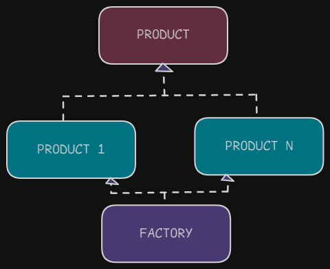
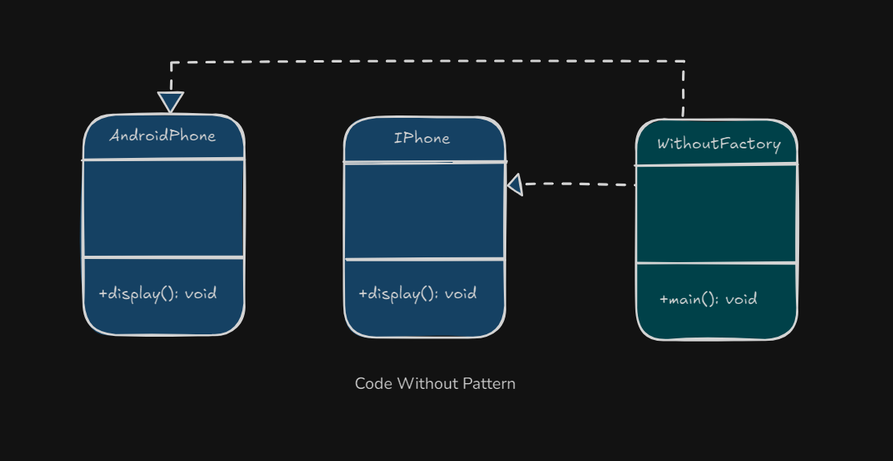
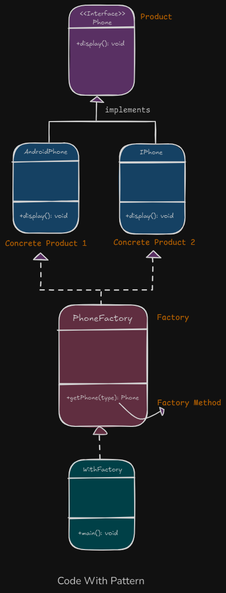

# 1. Factory Design Pattern

1. What is It?
2. Where and Why do We Use It?
3. Key Components
4. Principle Method
5. Examples of Real-World Scenario
6. Code without Pattern
7. Code with Pattern
8. Use cases of
9. Advantages & Disadvantages


## 1. What is It?

The **Factory Design Pattern** is a way to create objects without specifying their exact class name. Instead, we use a special method (**called a factory method**) to create these objects.

## 2. Where and Why Do We Use It?

- **Where:**
  - When you need to create objects but don’t want to hard-code the exact class names in your code.
- **Why:**
  - It makes your code flexible and easy to maintain.
  - You can add new types of objects without changing existing code.

**Example:** A mobile phone company making phones of different models (e.g., Android, iPhone) using the same manufacturing process.

## 3. Key Components

<p align="center">
  
</p>

1. **Factory:** A class or method that creates objects.
2. **Product:** The objects created by the factory.
3. **Concrete Product:** The actual objects (e.g., Android Phone, iPhone).

## 4. Principle Method

The **factory method** uses polymorphism to decide which object to create.

## 5. Examples of Real-World Scenario

Imagine you are ordering a pizza online:

- You only select the type (Veg or Non-Veg).
- The restaurant decides the exact recipe and ingredients for the pizza.

This is similar to the Factory Design Pattern.

## 6. Code Without Pattern

<p align="center">
  
</p>

```java
class AndroidPhone {
    void display() {
        System.out.println("Android Phone");
    }
}

class IPhone {
    void display() {
        System.out.println("iPhone");
    }
}

public class WithoutFactory {
    public static void main(String[] args) {
        AndroidPhone androidPhone = new AndroidPhone();
        IPhone iPhone = new IPhone();

        androidPhone.display();
        iPhone.display();
    }
}
```

In this code, we create objects with specifying their exact class name.

    • WithoutFactory directly creates instances of AndroidPhone and IPhone.
    • There’s no abstraction or central place to manage object creation.

## 7. Code With Pattern

<p align="center">
  
</p>

```java
// Step 1: Create an interface (Product)
interface Phone {
    void display();
}

// Step 2: Create concrete classes (Concrete Products)
class AndroidPhone implements Phone {
    public void display() {
        System.out.println("Android Phone");
    }
}

class IPhone implements Phone {
    public void display() {
        System.out.println("iPhone");
    }
}

// Step 3: Create a factory class (Factory)
class PhoneFactory {
    public static Phone getPhone(String type) {
        if (type.equalsIgnoreCase("android")) {
            return new AndroidPhone();
        } else if (type.equalsIgnoreCase("iphone")) {
            return new IPhone();
        }
        return null;
    }
}

// Step 4: Use the factory in the main method
public class WithFactory {
    public static void main(String[] args) {
        Phone android = PhoneFactory.getPhone("android");
        Phone iphone = PhoneFactory.getPhone("iphone");

        android.display();
        iphone.display();
    }
}
```

In this code, we use a special method (called a factory method) to create these objects

    • Interface (Phone): Represents the abstraction for all phone types.
    • Concrete Classes (AndroidPhone, IPhone): Implement the Phone interface.
    • Factory Class (PhoneFactory): Responsible for creating objects of the appropriate type based on input.

    Advantages:
    • Object creation logic is centralized in PhoneFactory.
    • Adding new phone types requires minimal changes.

## 8. Use Cases

- Payment gateways (e.g., PayPal, Stripe).
- Vehicle manufacturing (e.g., Car, Bike).
- Database connections (e.g., MySQL, MongoDB).

## 9. Advantages & Disadvantages

### Advantages

    1. Loose Coupling: The main code is not tightly tied to specific classes.
    2. Scalability: Adding new product types is easy.
    3. Maintenance: Code is more organized.

### Disadvantages

    1. Complexity: Adds extra layers (interface, factory).
    2. Limited Customization: Factory may not handle very unique object requirements.

By using the Factory Design Pattern, your code becomes cleaner, more flexible, and easier to manage.
