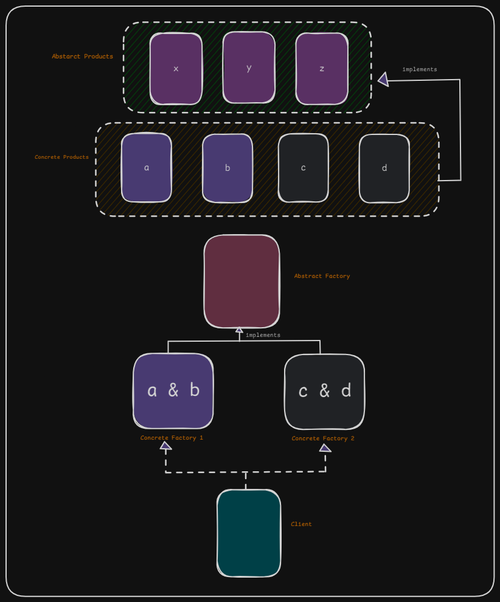
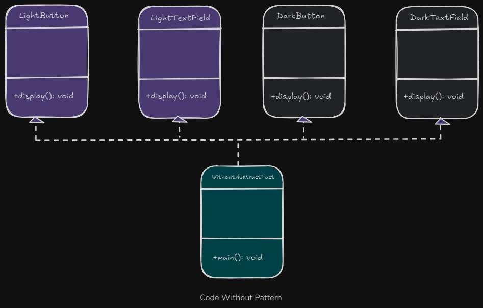
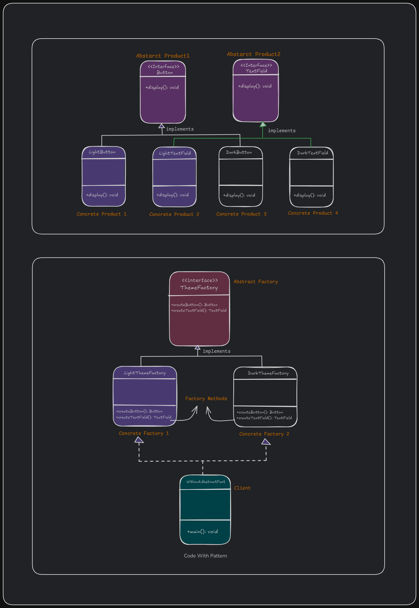
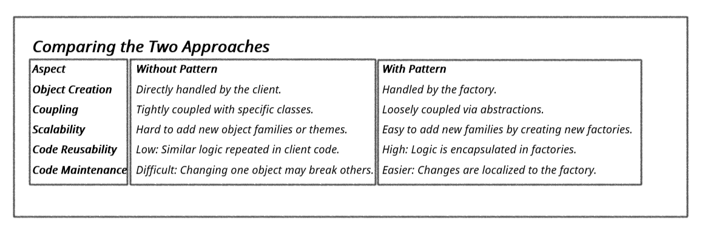

# 2. Abstract Factory Design Pattern

1. What is It?
2. Where and Why do We Use It?
3. Key Components
4. Principle Method
5. Examples of Real-World Scenario
6. Code without Pattern
7. Code with Pattern
8. Use cases of
9. Advantages & Disadvantages

## 1. What is It?

The **Abstract Factory Design Pattern** provides a way to create families of related objects without specifying their concrete classes.
It’s like a factory of factories, where each factory is responsible for creating a specific group of objects.

## 2. Where and Why Do We Use It?

- **Where:**
  - When a system needs to support multiple product families (e.g., themes, device types) with related objects.
- **Why:**
  - To group object creation logic for related objects.
  - To maintain flexibility and scalability.

**Example:** A furniture company that produces different styles (e.g., Victorian, Modern). Each style has related items like chairs and tables.

## 3. Key Components

<p align="center">
  
</p>

1. **Abstract Factory:** An interface or abstract class to create families of objects.
2. **Concrete Factory:** Implements the abstract factory to create specific product families.
3. **Abstract Product:** An interface or abstract class for a type of product.
4. **Concrete Product:** Implements the abstract product for a specific family.
5. **Client:** Uses the factories and products.

## 4. Principle Method

Use the **factory of factories** concept, where the client only interacts with the abstract factory and abstract product interfaces.

## 5. Examples of Real-World Scenario

Imagine you are buying a theme for a website. Each theme (e.g., Dark, Light) has its own buttons and text fields, but the user only selects the theme. The website loads the correct set of related components.

## 6. Code Without Pattern

<p align="center">
  
</p>

```java
class LightButton {
    void display() {
        System.out.println("Light Button");
    }
}

class DarkButton {
    void display() {
        System.out.println("Dark Button");
    }
}

class LightTextField {
    void display() {
        System.out.println("Light TextField");
    }
}

class DarkTextField {
    void display() {
        System.out.println("Dark TextField");
    }
}

public class WithoutAbstractFactory {
    public static void main(String[] args) {
        LightButton lightButton = new LightButton();
        LightTextField lightTextField = new LightTextField();

        DarkButton darkButton = new DarkButton();
        DarkTextField darkTextField = new DarkTextField();

        lightButton.display();
        lightTextField.display();
        darkButton.display();
        darkTextField.display();
    }
}
```

In this code,

    • Object creation is directly managed by the client (WithoutAbstractFactory).
    • Each object (e.g., LightButton, LightTextField) is instantiated explicitly using new.
    • The client has to know the exact classes (e.g., LightButton or DarkButton) it needs to create.

## 7. Code With Pattern

<p align="center">
  
</p>

```java
// Step 1: Abstract Products
interface Button {
    void display();
}

interface TextField {
    void display();
}

// Step 2: Concrete Products
class LightButton implements Button {
    @Override
    public void display() {
        System.out.println("Light Button");
    }
}

class DarkButton implements Button {
    @Override
    public void display() {
        System.out.println("Dark Button");
    }
}

class LightTextField implements TextField {
    @Override
    public void display() {
        System.out.println("Light TextField");
    }
}

class DarkTextField implements TextField {
    @Override
    public void display() {
        System.out.println("Dark TextField");
    }
}

// Step 3: Abstract Factory
interface ThemeFactory {
    Button createButton();
    TextField createTextField();
}

// Step 4: Concrete Factories
class LightThemeFactory implements ThemeFactory {
    @Override
    public Button createButton() {
        return new LightButton();
    }

    @Override
    public TextField createTextField() {
        return new LightTextField();
    }
}

class DarkThemeFactory implements ThemeFactory {
    @Override
    public Button createButton() {
        return new DarkButton();
    }

    @Override
    public TextField createTextField() {
        return new DarkTextField();
    }
}

// Step 5: Client
public class WithAbstractFactory {
    public static void main(String[] args) {
        ThemeFactory themeFactory = new LightThemeFactory(); // Change to DarkThemeFactory for dark theme

        Button button = themeFactory.createButton();
        TextField textField = themeFactory.createTextField();

        button.display();
        textField.display();
    }
}
```

In this code,

    • Object creation is abstracted using the Abstract Factory Design Pattern.
    • The client interacts only with an interface (ThemeFactory) and doesn’t need to know the specific classes being used.
    • The factory (LightThemeFactory or DarkThemeFactory) is responsible for creating related objects (Button, TextField) for a particular theme.

<p align="center">
  
</p>

## 8. Use Cases

- GUI frameworks (e.g., Windows vs. macOS themes).
- Cross-platform game development.
- Database drivers (e.g., MySQL vs. PostgreSQL).

## 9. Advantages & Disadvantages

### Advantages

    1. Consistency: Ensures all products in a family match.
    2. Scalability: Adding new product families is easy.
    3. Separation of Concerns: The client code doesn’t depend on specific product classes.

### Disadvantages

    1. Complexity: More interfaces and classes are required.
    2. Rigid Structure: Adding a new product to an existing family requires changes to all factories.
