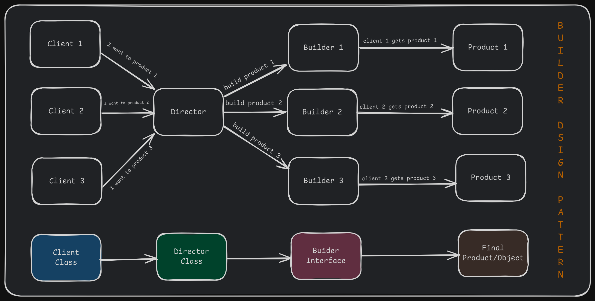
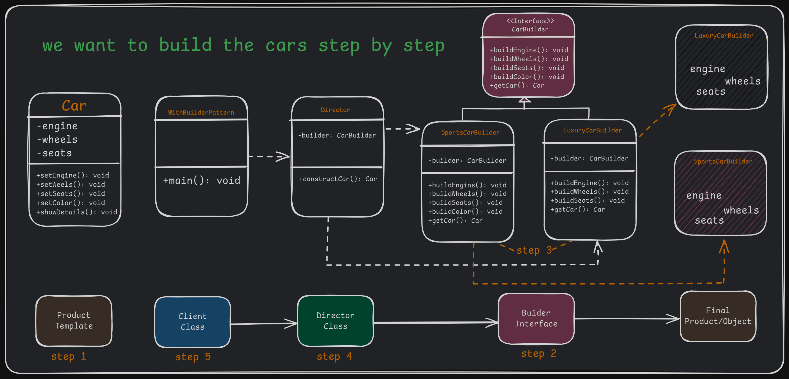
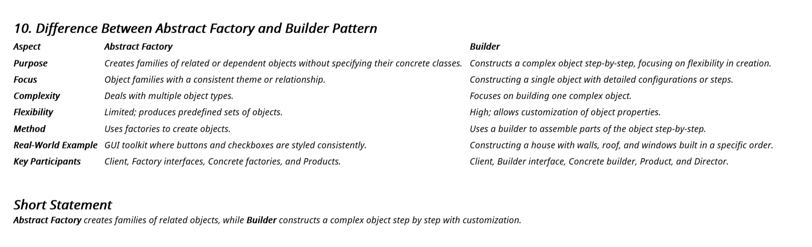

# 3. Builder Design Pattern

1. What is It?
2. Where and Why do We Use It?
3. Key Components
4. Principle Method
5. Examples of Real-World Scenario
6. Code without Pattern
7. Code with Pattern
8. Use cases of
9. Advantages & Disadvantages
10. Difference Between Abstract Factory and Builder Pattern

## 1. What is It?

The **Builder Design Pattern** is a creational pattern used to construct complex objects **step by step**. Unlike the Factory pattern, which creates objects in one go, the Builder pattern allows building parts of the object incrementally and flexibly.

## 2. Where and Why Do We Use It?

- **Where to Use:**
  - When creating complex objects with many optional parameters or configurations.
  - When constructing objects in a step-by-step manner.
- **Why to Use:**
  - To simplify object creation when there are many parameters.
  - To avoid having a large constructor with multiple arguments.
  - To improve the readability and maintainability of code.

## 3. Key Components

<p align="center">
  
</p>

1. **Builder:** An abstract class or interface defining the steps to build the product.
2. **Concrete Builder:** Implements the Builder interface to construct and assemble parts of the product.
3. **Product**: The final object being built.
4. **Director (_Optional_):** Controls the object creation process using the Builder. ( Director gives the instructions to the builder to build the final product )
5. **Client:** The Client is the code that initiates the construction of the complex object. It creates a Builder object and passes it to the Director to initiate the construction process. The Client may retrieve the final product from the Builder after construction is complete.

## 4. Principle Method

The pattern separates the construction logic (handled by the builder) from the representation of the final product. This ensures flexibility and makes the construction process reusable and independent.

## 5. Examples of Real-World Scenario

5. Examples of Real-World Scenario

   - **House Construction:** Building a house involves steps like constructing walls, adding a roof, installing doors, etc., which can vary based on the type of house.
   - **Restaurant Meal Order:** You can build a meal by choosing optional components like a drink, dessert, or side dish.

    <p align="center">
     
    </p>

## 6. Code Without Pattern

```java
// Product Class
class Car {
    private String engine;
    private String wheels;
    private String seats;
    private String color;

    // Construct a car with engine, wheels and seats
    public Car(String engine, String wheels, String seats, String color) {
        this.engine = engine;
        this.wheels = wheels;
        this.seats = seats;
        this.color = color;
    }

    public void showDetails() {
        System.out.println("Car with Engine: " + engine + ", Wheels: " + wheels + ", Seats: " + seats + ", Color: " + color);
    }
}

// Client Code
public class WithoutBuilderPattern {
    public static void main(String[] args) {
        Car car = new Car("V6", "MRF", "Leather", "Red");
        car.showDetails(); // Car with Engine: V6, Wheels: MRF, Seats: Leather, Color: Red
    }
}
```

In this code,

    • The constructor becomes difficult to manage with more parameters.
    • Hard to read and maintain the code when object creation logic changes.

## 7. Code With Pattern

<p align="center">
  
</p>

```java
// Step 1: Product Class
class Car {
    private String engine;
    private String wheels;
    private String seats;
    private String color;

    public void setEngine(String engine) { this.engine = engine; }
    public void setWheels(String wheels) { this.wheels = wheels; }
    public void setSeats(String seats) { this.seats = seats; }
    public void setColor(String color) { this.color = color; }

    public void showDetails() {
        System.out.println("Car with Engine: " + engine + ", Wheels: " + wheels + ", Seats: " + seats + ", Color: " + color);
    }
}

// Step 2: Builder Interface
interface CarBuilder {
    void buildEngine();
    void buildWheels();
    void buildSeats();
    void buildColor();
    Car getCar();
}

// Step 3: Concrete Builder
class SportsCarBuilder implements CarBuilder {
    private Car car;

    public SportsCarBuilder() {
        car = new Car();
    }

    // Step by step construction of the car
    @Override
    public void buildEngine() { car.setEngine("V8"); }
    @Override
    public void buildWheels() { car.setWheels("Sports Alloy"); }
    @Override
    public void buildSeats() { car.setSeats("Racing Seats"); }
    @Override
    public void buildColor() { car.setColor("Red"); }
    @Override
    public Car getCar() { return car; }
}

// Step 4: Director
class Director {
    private CarBuilder builder;

    public Director(CarBuilder builder) {
        this.builder = builder;
    }

    // Method to construct the car
    public Car constructCar(boolean wantColor) {
        if (wantColor) {
            builder.buildColor();
        }
        builder.buildEngine();
        builder.buildWheels();
        builder.buildSeats();
        return builder.getCar();
    }
}

// Step 5: Client Code
public class WithBuilderPattern {
    public static void main(String[] args) {
        CarBuilder builder = new SportsCarBuilder();
        Director director = new Director(builder);

        Car car = director.constructCar(true);
        car.showDetails(); // Output: Car with Engine: V8, Wheels: Sports Alloy, Seats: Racing Seats, Color: Red
    }
}
```

In this code,

    • Flexibility in object construction.
    • Makes code more readable and easier to maintain.
    • Supports optional parameters easily.

## 8. Use Cases

- Creating complex objects like cars, meals, or houses.
- Building UI components with many configuration options.
- Constructing objects that require a specific sequence of steps.

## 9. Advantages & Disadvantages

### Advantages

    1. Readability: Easier to understand and maintain.
    2. Flexibility: Allows optional parameters without overloading constructors.
    3. Modularity: Each builder handles its own construction logic.

### Disadvantages

    1. Complexity: Requires additional classes like Director and Builder.
    2.Overhead: May feel excessive for simple objects.

## 10. Difference Between Abstract Factory and Builder Design Pattern

<p align="center">
  
</p>
