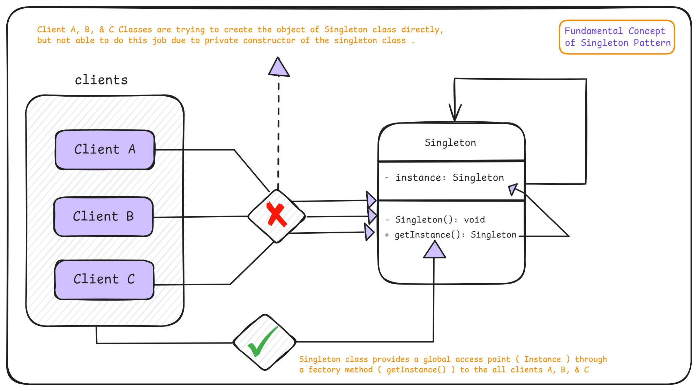
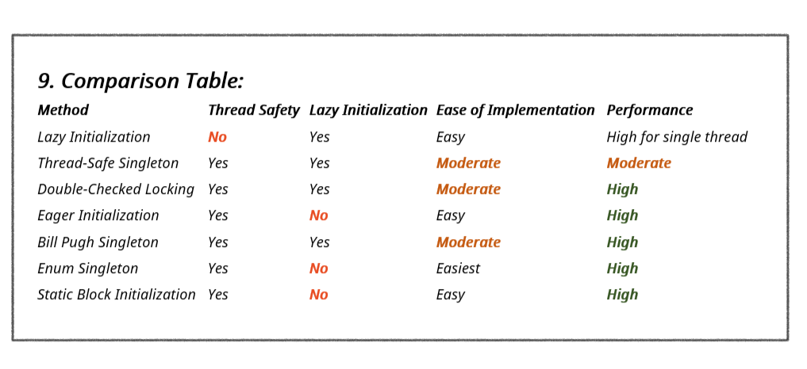

# 4. Singleton Design Pattern

1. What is It?
2. Where and Why do We Use It?
3. Key Components
4. Principle Method
5. Examples of Real-World Scenario
6. 7 Ways to Implement It in Java
7. Use cases of
8. Advantages & Disadvantages
9. Comparison Table & Recommendation

> Best Resource to Know About It: https://blog.algomaster.io/p/singleton-design-pattern

## 1. What is It?

The **Singleton Design Pattern** ensures that only one instance of a class exists throughout the application and provides a global point of access to it.

<p align="center">
  
</p>

```java
// Implementing Singleton Design Pattern in Java
class Singleton {
    // Static member holds only one instance of the Singleton class & it is initially null
    private static Singleton instance;

    // Singleton class private constructor to prevent instantiation from other classes
    private Singleton(){
        System.out.println("Singleton is Instantiated.");
    }

    // Static factory method to provide the global point of access to the Singleton class
    public static Singleton getInstance(){
        if (instance == null){
            // If there is no instance available, create a new one
            instance = new Singleton();
        }

        // Return the Singleton instance
        return instance;
    }
}


// ClientA
public class ClientA {
    public static void main(String[] args) {
        Singleton singleton = Singleton.getInstance();
        System.out.println("Client A: Singleton is " + singleton);
    }
}
```

## 2. Where and Why Do We Use It?

- **Where to Use:**
  - When only one instance of a class is needed (e.g., configuration managers, database connections, or logging).
- **Why to Use:**
  - To ensure a single, consistent state of an object is used across the application.
  - To save resources by avoiding multiple object creation.

## 3. Key Components

1. **Singleton Class:** A class that controls its own instance and prevents creating multiple instances.
2. **Private Constructor:** Ensures the class cannot be instantiated from outside.
3. **Static Member/Instance:** Holds only single instance of the class and it is initially null.
4. **Global Access Point:** Static factory method provides access to the single instance.

## 4. Principle Method

The Singleton pattern ensures a single instance of the class is created by controlling object creation through a private constructor and providing a global static method to access the instance.

## 5. Examples of Real-World Scenario

   - **Printer Spooler:** Ensures only one printer spooler is used to manage printing jobs.
   - **Configuration Manager:** Provides a single source of truth for application settings.
   - **Logger:** Centralizes logging to ensure consistent output.

## 6. 7 Ways to Implement It in Java

1. Lazy Initialization
2. Thread Safe Singleton
3. Double Checked Locking
4. Eger Initialization
5. Bill Pugh Singleton
6. Enum Singleton
7. Static Block Initialization

### 1. Lazy Initialization

In this approach, the instance is created only when it is first accessed ( needed ), saving resources if the singleton is never used in the application.

```java
class LazySingleton {
    // The single instance, initially null
    private static LazySingleton instance;

    // Private constructor to prevent instantiation
    private LazySingleton() {
        System.out.println("LazySingleton is Instantiated.");
    }

    // Public method to get the instance
    public static LazySingleton getInstance() {
        // Check if instance is null
        if (instance == null) {
            // If null, create a new instance
            instance = new LazySingleton();
        }
        // Return the instance (either newly created or existing)
        return instance;
    }
}
```

- **Pros:** Saves memory by delaying instance creation.
- **Cons:** This implementation is not thread-safe. If multiple threads call `getInstance()` simultaneously when instance is null, it's possible to create multiple instances.

### 2. Thread Safe Singleton

This approach is similar to lazy initialization but also ensures that the singleton is thread-safe. This is achieved by making the **getInstance()** method **synchronized** ensuring only one thread can execute this method at a time. When a thread enters the synchronized method, it acquires a lock on the class object. Other threads must wait until the method is executed.

```java
class ThreadSafeSingleton {
    // The single instance, initially null
    private static ThreadSafeSingleton instance;

    // Private constructor to prevent instantiation
    private ThreadSafeSingleton() {
        System.out.println("ThreadSafeSingleton is Instantiated.");
    }

    // Public method to get the instance, with synchronized keyword
    public static synchronized ThreadSafeSingleton getInstance() {
        // Check if instance is null
        if (instance == null) {
            // If null, create a new instance
            instance = new ThreadSafeSingleton();
        }
        // Return the instance (either newly created or existing)
        return instance;
    }
}
```

- **Pros:** Ensures thread safety.
- **Cons:** Reduced performance due to synchronization.

### 3. Double Checked Locking

This approach minimizes performance overhead from synchronization by only synchronizing when the object is first created. It uses the **volatile** keyword to ensure that changes to the instance variable are immediately visible to other threads. ( **Improves performance by synchronizing only during the first instance creation.** )

```java
class DoubleCheckedSingleton {
    // The single instance, initially null, marked as volatile to ensure visibility
    private static volatile DoubleCheckedSingleton instance;

    // Private constructor to prevent instantiation
    private DoubleCheckedSingleton() {
        System.out.println("DoubleCheckedSingleton is Instantiated.");
    }

    // Public method to get the instance
    public static DoubleCheckedSingleton getInstance() {
        // First check (not synchronized)
        if (instance == null) {
            // Synchronize on the class object
            synchronized (DoubleCheckedSingleton.class) {
                // Second check (synchronized)
                if (instance == null) {
                    // Create the instance
                    instance = new DoubleCheckedSingleton();
                }
            }
        }
        // Return the instance (either newly created or existing)
        return instance;
    }
}
```

- **Pros:** Thread-safe with better performance.
- **Cons:** Slightly more complex implementation.

### 4. Eger Initialization

The instance is created at the time of class loading. This implementation is one of the simplest and inherently thread-safe without needing explicit synchronization.

```java
class EagerSingleton {
    // The single instance, created immediately
    private static final EagerSingleton instance = new EagerSingleton();

    // Private constructor to prevent instantiation
    private EagerSingleton() {
        System.out.println("EagerSingleton is Instantiated.");
    }

    // Public method to get the instance
    public static EagerSingleton getInstance() {
        return instance;
    }
}
```

    • static variable ensures there's only one instance shared across all instances of the class.
    • final prevents the instance from being reassigned after initialization.

- **Pros:** Simple implementation.
- **Cons:** May create the instance unnecessarily if it is never used.

### 5. Bill Pugh Singleton

Uses an **inner static helper class** to hold the singleton instance, which is loaded only when needed. It is thread-safe without requiring explicit synchronization.

```java
class BillPughSingleton {
    // Private constructor to prevent instantiation
    private BillPughSingleton() {
        System.out.println("BillPughSingleton is Instantiated.");
    }

    // Static inner class that holds the instance
    private static class SingletonHelper {
        private static final BillPughSingleton INSTANCE = new BillPughSingleton();
    }

    // Public method to get the instance
    public static BillPughSingleton getInstance() {
        return SingletonHelper.INSTANCE;
    }
}
```

    • When the getInstance() method is called for the first time, it triggers the loading of the SingletonHelper class.
    • When the inner class is loaded, it creates the INSTANCE of BillPughSingleton.
    • The final keyword ensures that the INSTANCE cannot be reassigned.

- **Pros:** Thread-safe and efficient.
- **Cons:** Slightly more complex structure.

### 6. Enum Singleton

Uses an **Enum** to implement the Singleton pattern rather then a class. The Enum Singleton pattern is the most robust and concise way to implement a singleton in Java.

Java ensures that only one instance of an Enum value is created, even in a multithreaded environment.

```java
public enum EnumSingleton {
    INSTANCE;

    public void doSomething() {
        // Add any singleton logic here
    }
}
```

- **Pros:** Simplest, thread-safe, and prevents reflection and serialization issues.
- **Cons:** Less flexible, can't implement lazy initialization. And it's not always suitable, especially if you need to extend a class or if lazy initialization is a strict requirement.

### 7. Static Block Initialization

The instance is created in a **static block**, allowing exception handling during initialization. It provides the ability to handle exceptions during instance creation, which is not possible with simple eager initialization.

```java
class StaticBlockSingleton {
    // The single instance
    private static StaticBlockSingleton instance;

    // Private constructor to prevent instantiation
    private StaticBlockSingleton() {
        System.out.println("StaticBlockSingleton is Instantiated.");
    }

    // Static block for initialization
    static {
        try {
            instance = new StaticBlockSingleton();
        } catch (Exception e) {
            throw new RuntimeException("Exception occurred in creating singleton instance");
        }
    }

    // Public method to get the instance
    public static StaticBlockSingleton getInstance() {
        return instance;
    }
}
```

    • The static block is executed when the class is loaded by the JVM.
    • If an exception occurs, it's wrapped in a RuntimeException.

- **Pros:** Handles exceptions.
- **Cons:** Similar to eager initialization, may create the instance unnecessarily. And it is thread safe but not lazy-loaded, which might be a drawback if the initialization is resource-intensive or time-consuming.

## 7. Use Cases

- **Managing Shared Resources** (database connections, thread pools, caches, configuration settings)
- **Coordinating System-Wide Actions** (logging, print spoolers, file managers)
- **Managing State** (user session, application state)

  - **Logger Classes:** Many logging frameworks use the Singleton pattern to provide a global logging object. This ensures that log messages are consistently handled and written to the same output stream.
  - **Database Connection Pools:** Connection pools help manage and reuse database connections efficiently. A Singleton can ensure that only one pool is created and used throughout the application.
  - **Cache Objects:** In-memory caches are often implemented as Singletons to provide a single point of access for cached data across the application.
  - **Thread Pools:** Thread pools manage a collection of worker threads. A Singleton ensures that the same pool is used throughout the application, preventing resource overuse.
  - **File System:** File systems often use Singleton objects to represent the file system and provide a unified interface for file operations.
  - **Print Spooler:** In operating systems, print spoolers manage printing tasks. A single instance coordinates all print jobs to prevent conflicts.

## 8. Advantages & Disadvantages

### Advantages

    1. Ensures a single instance across the application.
    2. Saves resources by avoiding multiple object creation.
    3. Provides controlled access to the instance.

### Disadvantages

    1. Difficult to unit test as it introduces global state.
    2. May lead to tightly coupled code.
    3. Thread-safety issues if not implemented correctly in multithreaded environments.

## 9. Comparison Table & Recommendation

<p align="center">
  
</p>

### Recommendation:

- Use **Bill Pugh Singleton** for most cases as it is thread-safe and efficient.
- Use **Enum Singleton** for simplicity and prevention of reflection/serialization issues.
