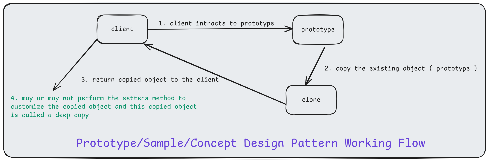
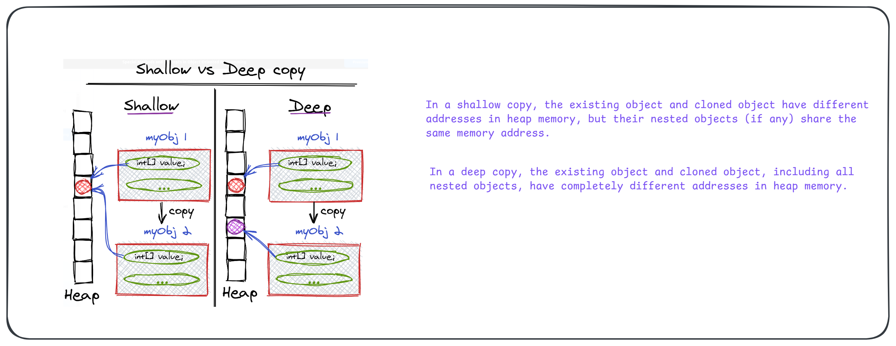
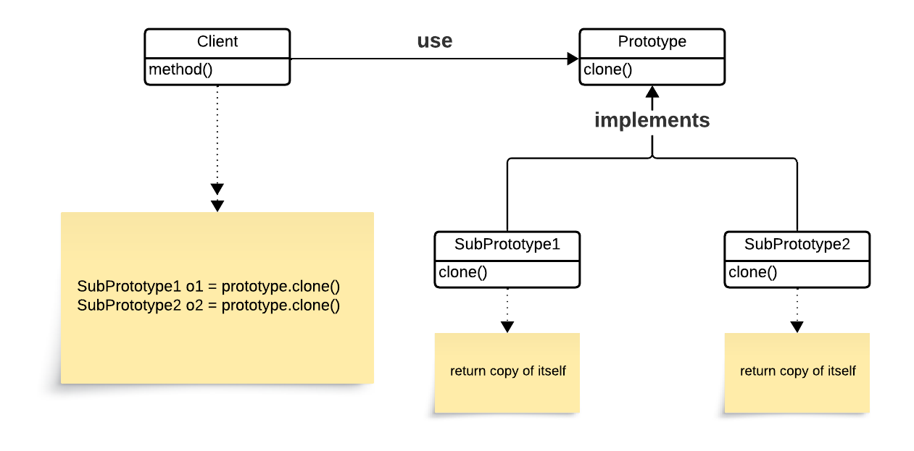
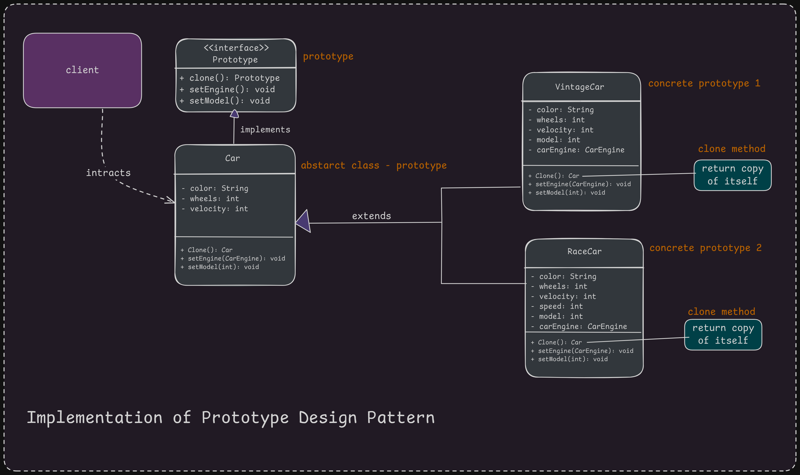

# 5. Prototype Design Pattern

1. What is It?
2. Where and Why do We Use It?
3. Big Problem Solved by It
4. Working Flow and Shallow Vs Deep Copy
5. Key Components
6. Principle Method
7. Implement It in Java
8. Examples of Real-World Scenario
9. Use cases of
10. Advantages & Disadvantages

## 1. What is It?

The **Prototype Design Pattern** is a creational design pattern. It allows you to create new objects by copying existing ones (_prototypes_), instead of creating them from scratch. This pattern is useful when the cost of creating a new object is high, and you can reuse existing objects as _templates_.

## 2. Why and When to Use the Prototype Design Pattern

- **Why Use It?**

1. Expensive Object Creation: When creating an object involves significant resource consumption (e.g., database calls, network operations, or large file processing).
2. Frequent Object Cloning: When objects with similar configurations are frequently needed.
3. Avoid Constructor Complexity: When creating an object via a constructor involves too many arguments or complex logic.
4. Improve Performance: Cloning an existing object is faster and less resource-intensive than creating a new one from scratch.

- **When to Use It?**

1. When new objects differ slightly from existing ones.
2. When the system needs to generate many similar objects dynamically.
3. When working with frameworks that require object cloning for performance (e.g., in caching or simulation systems).

## 3. Big Problem Solved by It

We can use the Prototype Design Pattern when creating a new object is expensive (_e.g., interacting with various resources like database connections, file systems, or external APIs_). Additionally, it is useful when a new object has only slight differences from an existing object (_e.g., a car object with engine v2, color red, and 4 wheels, and the new car object has engine v3 but retains other properties_).

## 4. Working Flow and Shallow Vs Deep Copy

<p align="center">
  
</p>

<p align="center">
  
</p>

## 5. Key Components

<p align="center">
  
</p>

1. **Prototype Interface or Abstract Class**
   - This defines the method for cloning objects and sets a standard that all concrete prototypes must follow. Its main purpose is to serve as a blueprint for creating new objects by outlining the cloning contract.
   - It includes a clone method that concrete prototypes will implement to create copies of themselves.
2. **Concrete Prototype**
   - This class implements the prototype interface or extends the abstract class. It represents a specific type of object that can be cloned.
   - The Concrete Prototype details how the cloning process should work for instances of that class and provides the specific logic for the clone method.
3. **Client**
   - The Client is the code or module that requests new object creation by interacting with the prototype.
   - It initiates the cloning process without needing to know the specifics of the concrete classes involved.
4. **Clone Method**
   - This method is declared in the prototype interface or abstract class and outlines how an object should be copied.
   - Concrete prototypes implement this method to define their specific cloning behavior, detailing how to duplicate the object’s internal state to create a new, independent instance.

## 6. Principle Method

The principle method in the Prototype pattern is the _clone()_ method, which is used to create a duplicate of the existing object.

## 7. Implementation of Prototype Design Pattern

<p align="center">
  
</p>

```java
// Step 1: Prototype Interface
interface Prototype {
    Prototype clone();
    public void setEngine(CarEngine carEngine);
    public void setModel(int model);
}

class CarEngine {
    public CarEngine() {}
    public CarEngine(CarEngine carEngine) {
        // Write logic here to copy the object
        System.out.println("Copy Constructor Called");
    }
}


// Step 2: Base Class for Cars
abstract class Car implements Prototype {
    String color;
    int wheels;
    int velocity;

    public Car(String color, int wheels, int velocity) {
        this.color = color;
        this.wheels = wheels;
        this.velocity = velocity;
    }

    // Implement clone method
    @Override
    public abstract Car clone();

    // Implement setEngine method
    @Override
    public abstract void setEngine(CarEngine carEngine);

    // Implement setModel method
    @Override
    public abstract void setModel(int model);
}

// Step 3: RaceCar Class
class RaceCar extends Car {
    int model;
    CarEngine carEngine;
    int speed;

    public RaceCar() {
        super("RED", 4, 100);
        this.model = 2020;
        this.carEngine = new CarEngine();
        this.speed = 200;
    }

    private RaceCar(CarEngine carEngine, int model) {
        super("RED", 4, 100);
        this.model = model;
        this.carEngine = new CarEngine(carEngine); // Deep Copy - Copy Construtor
    }

    @Override
    public RaceCar clone() {
        return new RaceCar(this.carEngine, this.model);
    }

    @Override
    public void setEngine(CarEngine carEngine) {
        this.carEngine = carEngine;
    }

    @Override
    public void setModel(int model) {
        this.model = model;
    }
}

// Step 3: VintageCar Class
class VintageCar extends Car {
    int model;
    CarEngine carEngine;

    public VintageCar() {
        super("BLUE", 4, 200);
        this.model = 2024;
        this.carEngine = new CarEngine();
    }

    private VintageCar(CarEngine carEngine, int model) {
        super("BLUE", 4, 200);
        this.model = model;
        this.carEngine = new CarEngine(carEngine);
    }

    @Override
    public VintageCar clone() {
        return new VintageCar(this.carEngine, this.model);
    }

    @Override
    public void setEngine(CarEngine carEngine) {
        this.carEngine = carEngine;
    }

    @Override
    public void setModel(int model) {
        this.model = model;
    }
}

// Step 4: Client Code
public class PrototypePatternClient {
    public static void main(String[] args) {
        RaceCar raceCar = new RaceCar();
        VintageCar vintageCar = new VintageCar();

        RaceCar clonedRaceCar = raceCar.clone();
        VintageCar clonedVintageCar = vintageCar.clone();

        System.out.println(clonedRaceCar.model); // 2020
        System.out.println(clonedVintageCar.model); // 2024

        // We can change the properties of cloned objects
        clonedRaceCar.setEngine(new CarEngine());
        clonedRaceCar.setModel(2021);

        clonedVintageCar.setEngine(new CarEngine());
        clonedVintageCar.setModel(2025);

        System.out.println(clonedRaceCar.model); // 2021
        System.out.println(clonedVintageCar.model); // 2025
    }
}
```

## 8. Examples of Real-World Scenario

- **Game Development:** Cloning similar objects like enemies, weapons, or levels.
- **Document Templates:** Cloning a template to create a new document with predefined settings.

## 9. Use Cases

- Creating multiple similar objects in games or simulations.
- Duplicating complex objects like database connections, where creating new instances is resource-intensive.

## 10. Advantages & Disadvantages

### Advantages

    1. Reduces the cost of object creation.
    2. Allows dynamic creation of objects at runtime.
    3. Simplifies object creation in dynamic scenarios.

### Disadvantages

    1. Requires knowledge of cloning (e.g., clone() method).
    2. Cloning may lead to issues with mutable objects.
    3. May become complex with deep copy for nested objects.


