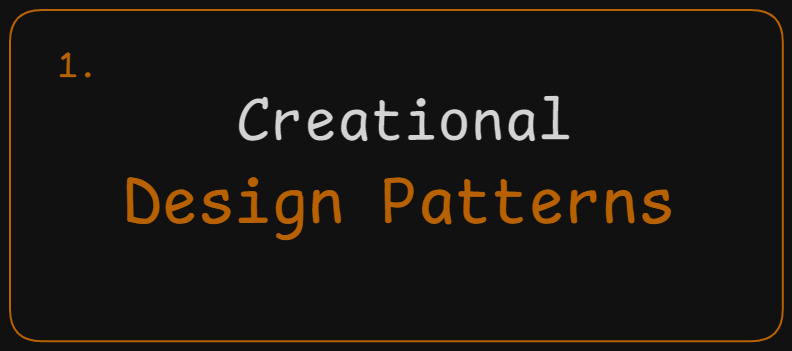

# What are Creational Patterns?

  

Creational Patterns are design patterns that focus on how objects are **created** in a software application. They provide solutions to control the creation process, making it more flexible, reusable, and efficient. Instead of instantiating objects directly, these patterns offer ways to create objects based on the situation.

Creational patterns give a lot of flexibility in **what** gets created, **who** creates it, and **how** it gets created.

## There are two main themes in these patters:

- They keep information about the specific classes used in the system hidden.
- They hide the details of how instances of these classes are created and assembled.

## Types of Creational Design Patterns?

There are mainly 5 types of creational design patterns:

1. Factory Method Design Patterns
2. Abstract Factory Method Design Patterns
3. Singleton Method Design Pattern
4. Prototype Method Design Patterns
5. Builder Method Design Patterns

## Each Pattern includes

    1. What is It?
    2. Where and Why do We Use It?
    3. Key Components
    4. Principle Method
    5. Examples of Real-World Scenario
    6. Code without Pattern
    7. Code with Pattern
    8. Use cases of
    9. Advantages & Disadvantages
