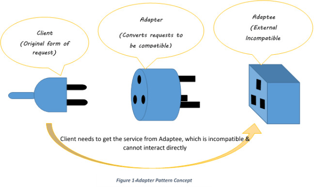
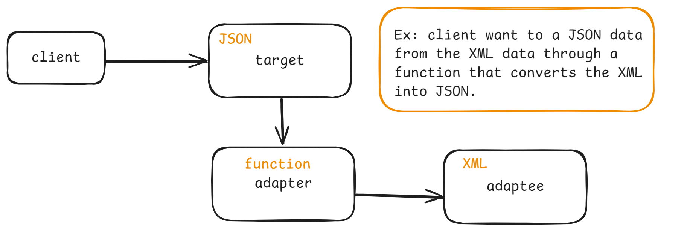
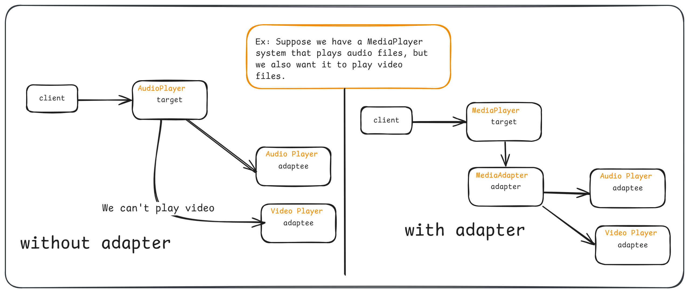
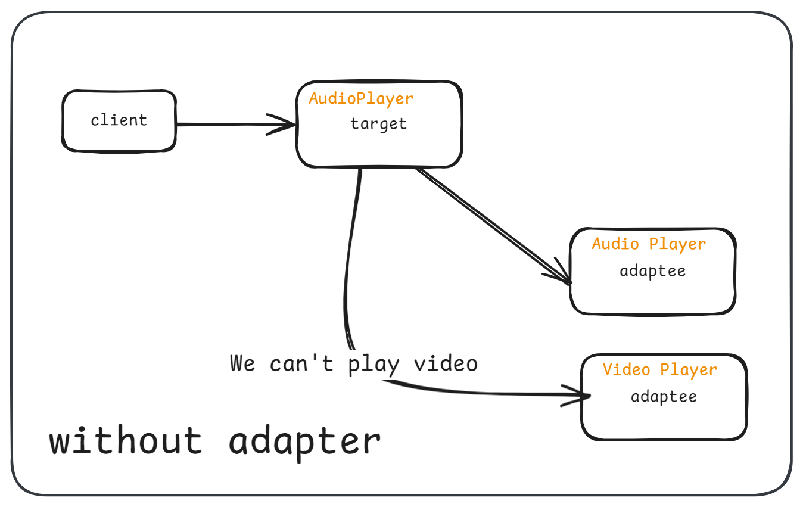
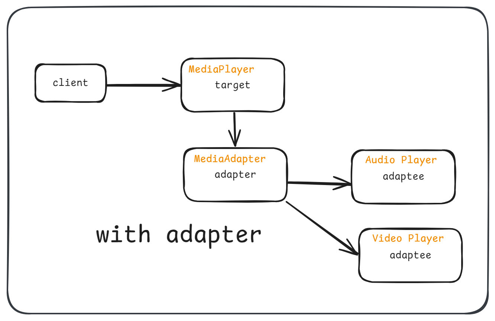
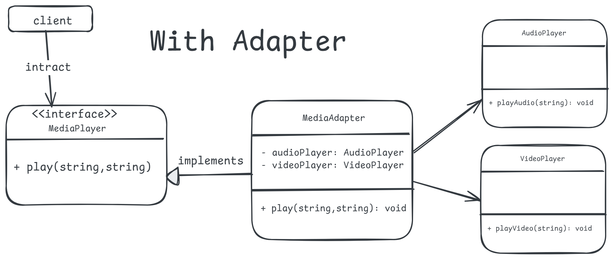

# 2. Adpater Design Pattern

1. What is It?
2. Where and Why do We Use It?
3. Key Components
4. Principle Method
5. Examples of Real-World Scenario
6. Code without Pattern
7. Code with Pattern
8. Use cases of
9. Advantages & Disadvantages

## 1. What is It?

The **Adapter Design Pattern** acts as a bridge between two incompatible interfaces, allowing them to work together. It converts one interface into another interface that a client expects. Think of it as a translator who helps two people speaking different languages understand each other.

### Analogy 1: I want to convert XML data to JSON data

<p align="center">
  
</p>

### Analogy 2: Client needs yo get the service from Adaptee, which is incompatible & cannot interact directly.

<p align="center">
  
</p>

### Analogy 3: Think of it as a translator who helps two people speaking different languages understand each other.

<p align="center">
  
</p>

## 2. Where and Why Do We Use It?

- **Where:**

  - When you have an existing class or library that you want to use, but its interface is not compatible with your system.
  - When working with legacy code and modern code together.

- **Why?**
  - To make unrelated interfaces work together.
  - To reuse existing functionality in a new system without modifying its original code.

## 3. Key Components

<p align="center">
  
</p>

1. **Target:** The interface or abstract class expected by the client.
2. **Adaptee:** The existing class or interface that needs to be adapted.
3. **Adapter:** A class that implements the target interface and translates calls to the adaptee.
4. **Client:** The code that uses the target interface to interact with objects. It remains unaware of the specific implementation details of the adaptee and the adapter. It’s the code that benefits from the integration of the adaptee into the system through the adapter.

## 4. Principle Method

The Adapter Pattern works by:

- Creating an adapter class that wraps the incompatible object (adaptee).
- The adapter class implements the target interface and translates the requests into something the adaptee can understand.

## 5. Examples of Real-World Scenario

### Example: Imagine a situation where:

- You have a mobile phone with a Type-C port (client).
- Your charger has a USB port (adaptee).
- You use a Type-C to USB adapter to connect the charger to your phone. The adapter allows two incompatible devices to work together.

### Example: Suppose we have a MediaPlayer system that plays audio files, but we also want it to play video files.

<p align="center">
  
</p>

## 6. Code Without Pattern

Suppose we have a MediaPlayer system that plays audio files, but we also want it to play video files. Without an adapter, the code would require modifications to handle both audio and video.

<p align="center">
  
</p>

```java
// Existing class to play audio
class AudioPlayer {
    public void playAudio(String fileName) {
        System.out.println("Playing audio: " + fileName);
    }
}

// Client code
public class MediaPlayerWithoutAdapter {
    public static void main(String[] args) {
        AudioPlayer audioPlayer = new AudioPlayer();

        audioPlayer.playAudio("song.mp3"); // This will work fine

        // Cannot play video files!
        // audioPlayer.playVideo("movie.mp4"); -> This won't work
    }
}
```

**Problem:** We cannot play video files without modifying the AudioPlayer class, which violates the Open/Closed Principle.

## 7. Code With Pattern

Using the Adapter Design Pattern, we can solve this problem by creating an adapter that makes the AudioPlayer and VideoPlayer work together.

<p align="center">
  
</p>

<p align="center">
  
</p>

```java
// Step 1: Target Interface
interface MediaPlayer {
    void play(String mediaType, String fileName);
}

// Step 2: Adaptee (Existing classes)
class AudioPlayer {
    public void playAudio(String fileName) {
        System.out.println("Playing audio: " + fileName);
    }
}

class VideoPlayer {
    public void playVideo(String fileName) {
        System.out.println("Playing video: " + fileName);
    }
}

// Step 3: Adapter Class
class MediaAdapter implements MediaPlayer {
    private AudioPlayer audioPlayer = new AudioPlayer();
    private VideoPlayer videoPlayer = new VideoPlayer();

    @Override
    public void play(String mediaType, String fileName) {
        if (mediaType.equalsIgnoreCase("audio")) {
            audioPlayer.playAudio(fileName);
        } else if (mediaType.equalsIgnoreCase("video")) {
            videoPlayer.playVideo(fileName);
        } else {
            System.out.println("Invalid media type: " + mediaType);
        }
    }
}

// Step 4: Client Code
public class MediaPlayerWithAdapter {
    public static void main(String[] args) {
        MediaPlayer mediaPlayer = new MediaAdapter();
        mediaPlayer.play("audio", "song.mp3");
        mediaPlayer.play("video", "movie.mp4");
    }
}
```

## 8. Use Cases

1. **Integration of Legacy Code:** When old code needs to work with a new system.
2. **Third-Party Libraries:** Adapting external libraries to match your project’s requirements.
3. **Device Compatibility:** Making different hardware or APIs compatible, like adapters in Java java.io.InputStreamReader.
4. **Gaming Engines:** Making old game mechanics work in newer engines.

## 9. Advantages & Disadvantages

### Advantages

    • Reusability: Allows the use of existing code without modification.
    • Flexibility: Makes incompatible interfaces work together seamlessly.
    • Separation of Concerns: Keeps the adaptee and client independent of each other.

### Disadvantages:

    • Complexity: Increases the number of classes in the system.
    • Performance: Slight overhead due to translation in the adapter class.
