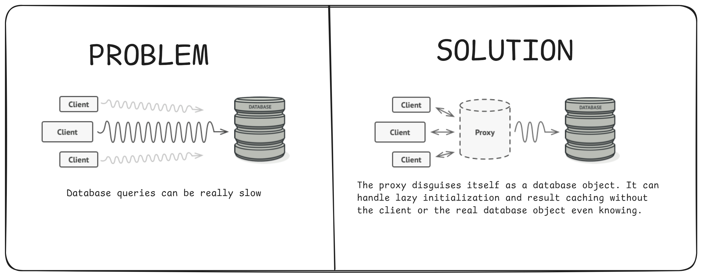
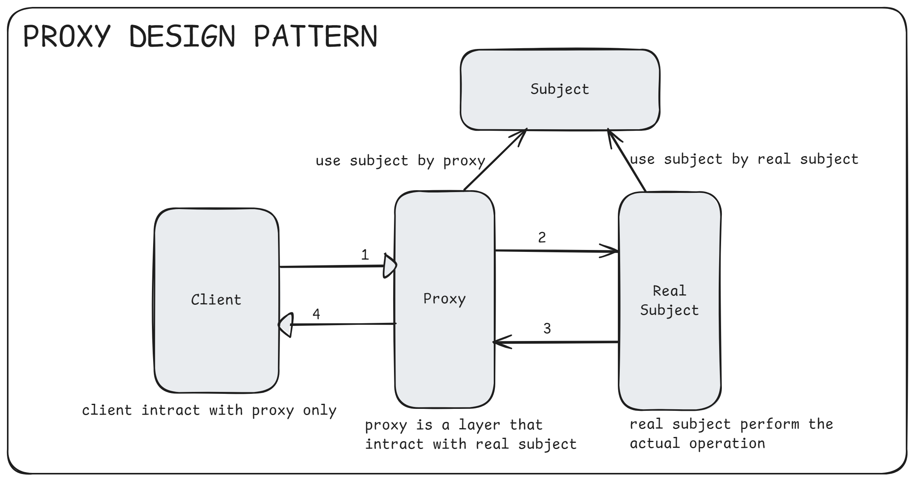
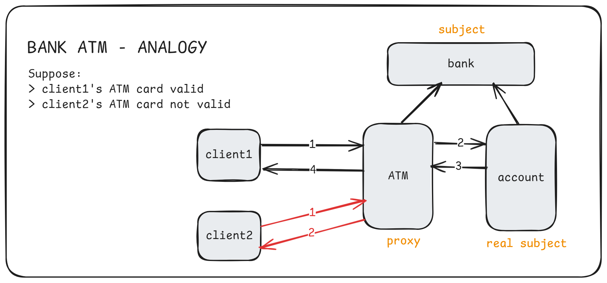
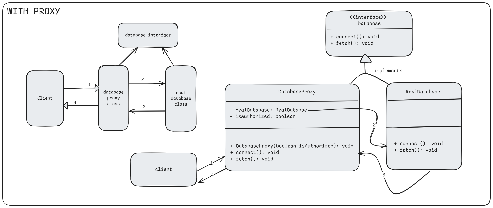

# 3. Proxy Design Pattern

1. What is It?
2. Where and Why do We Use It?
3. Key Components
4. Principle Method
5. Examples of Real-World Scenario
6. Code without Pattern
7. Code with Pattern
8. Use cases of
9. Advantages & Disadvantages

## 1. What is It?

The **Proxy Design Pattern** provides a substitute or placeholder for another object to control access to it. The proxy acts as a middleman that manages access to the real object, adding additional functionality like security, logging, or lazy initialization. Think of a proxy as an agent working on behalf of someone else.

<p align="center">
  
</p>

## 2. Where and Why Do We Use It?

- **Where:**

  - When direct access to an object is expensive or restricted.
  - When you need to control access to an object (e.g., for authentication or caching).

- **Why?**

  - To manage access to sensitive objects.
  - To improve performance by delaying object creation or controlling resource-intensive operations.
  - To add functionalities like logging, security checks, or caching without modifying the original class.

## 3. Key Components

<p align="center">
  
</p>

1. **Subject:** An interface or abstract class that both the proxy and the real object implement.
2. **Real Subject:** The actual object that performs the main operations.
3. **Proxy:** The middleman that controls access to the real subject.

## 4. Principle Method

The proxy works by implementing the same interface as the real object. _The client interacts with the proxy instead of the real object, and the proxy decides whether to pass the request to the real object or handle it itself._

## 5. Examples of Real-World Scenario

### Example: Imagine a situation where:

1. **Bank ATM:**

   The ATM acts as a proxy for your bank account. It doesn’t give you direct access to your account but lets you withdraw money, check your balance, etc.

2. **Internet Browsing:**

   A proxy server acts as an intermediary between your device and the internet, controlling and monitoring your access.

<p align="center">
  
</p>

## 6. Code Without Pattern

Suppose you have a class that connects to a database. Without a proxy, the client directly interacts with the database connection, even for basic tasks like logging or authorization.

<p align="center">
  
</p>

```java
class DatabaseConnection {
    public void connect() {
        System.out.println("Connecting to the database...");
    }

    public void fetchData() {
        System.out.println("Fetching data from the database...");
    }
}

// Client Code
public class WithoutProxyExample {
    public static void main(String[] args) {
        DatabaseConnection dbConnection = new DatabaseConnection();
        dbConnection.connect();
        dbConnection.fetchData();
    }
}
```

**Problem:** Every request goes directly to the database, making it difficult to control access or add functionality like logging, caching, or security.

## 7. Code With Pattern

Using the Proxy Design Pattern, we can create a proxy class to control access to the database.

<p align="center">
  
</p>

```java
// Step 1: Subject Interface
interface Database {
    void connect();
    void fetchData();
}

// Step 2: Real Subject
class RealDatabase implements Database {
    @Override
    public void connect() {
        System.out.println("Connecting to the database...");
    }

    @Override
    public void fetchData() {
        System.out.println("Fetching data from the database...");
    }
}

// Step 3: Proxy
class DatabaseProxy implements Database {
    private RealDatabase realDatabase;
    private boolean isAuthorized = false;

    public DatabaseProxy(boolean isAuthorized) {
        this.isAuthorized = isAuthorized;
    }

    @Override
    public void connect() {
        if (isAuthorized) {
            if (realDatabase == null) {
                realDatabase = new RealDatabase();
            }
            realDatabase.connect();
        } else {
            System.out.println("Access Denied: You are not authorized to connect to the database.");
        }
    }

    @Override
    public void fetchData() {
        if (isAuthorized) {
            if (realDatabase == null) {
                realDatabase = new RealDatabase();
            }
            realDatabase.fetchData();
        } else {
            System.out.println("Access Denied: You are not authorized to fetch data.");
        }
    }
}

// Client Code
public class WithProxyExample {
    public static void main(String[] args) {
        Database unauthorizedProxy = new DatabaseProxy(false);
        unauthorizedProxy.connect();
        unauthorizedProxy.fetchData();

        System.out.println("---");

        Database authorizedProxy = new DatabaseProxy(true);
        authorizedProxy.connect();
        authorizedProxy.fetchData();
    }
}
```

## 8. Use Cases

1. **Virtual Proxy:** Delay the creation of a heavy object until it is needed (e.g., loading large images).
2. **Remote Proxy:** Represent an object located in a different address space (e.g., RMI in Java).
3. **Protection Proxy:** Control access to an object based on permissions.
4. **Caching Proxy:** Cache results from the real object to avoid repetitive operations.

## 9. Advantages & Disadvantages

### Advantages

    1. Access Control: Protect sensitive resources with permission checks.
    2. Lazy Initialization: Load heavy objects only when needed.
    3. Logging and Monitoring: Add logging or performance monitoring without modifying the real object.
    4. Separation of Concerns: Keeps additional responsibilities like security or caching separate from the main business logic.

### Disadvantages:

    1. Overhead: Adds complexity and can slightly slow down the system.
    2. Single Responsibility Violation: The proxy may end up doing more than just controlling access if not designed carefully.
