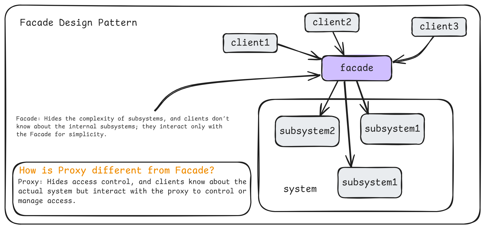
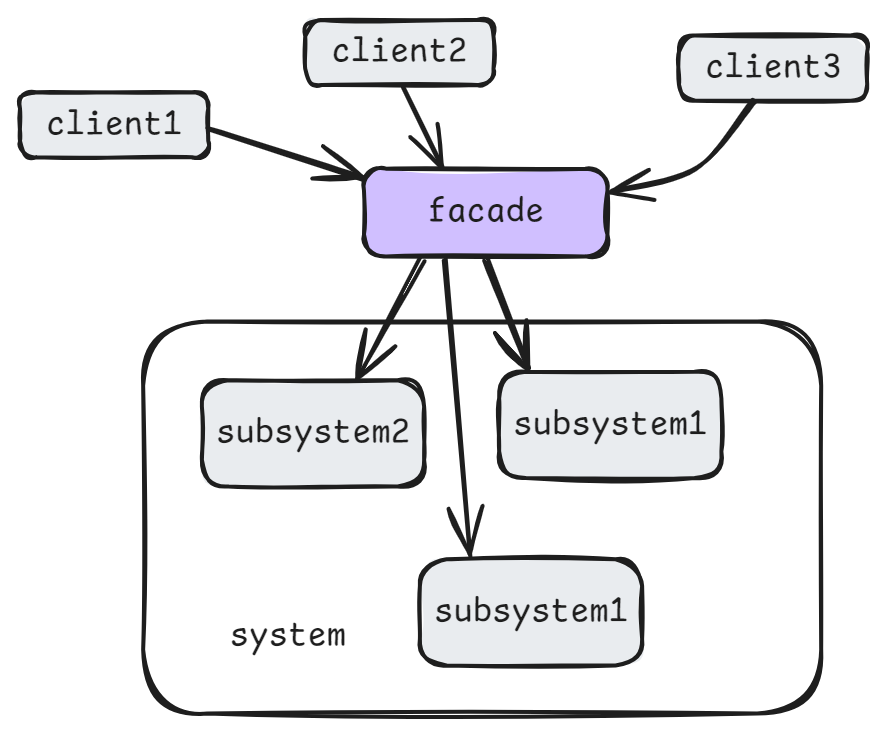
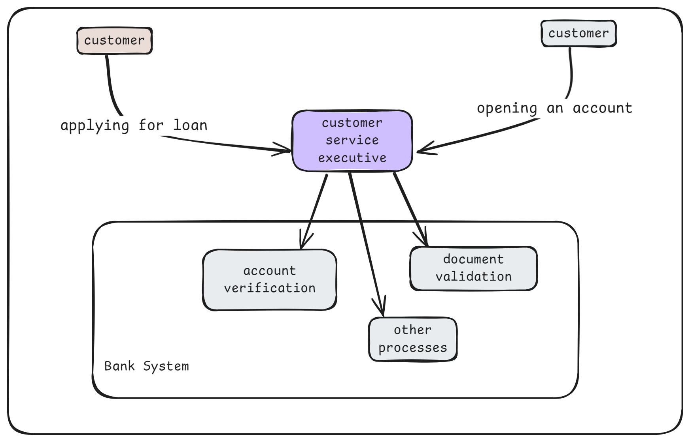
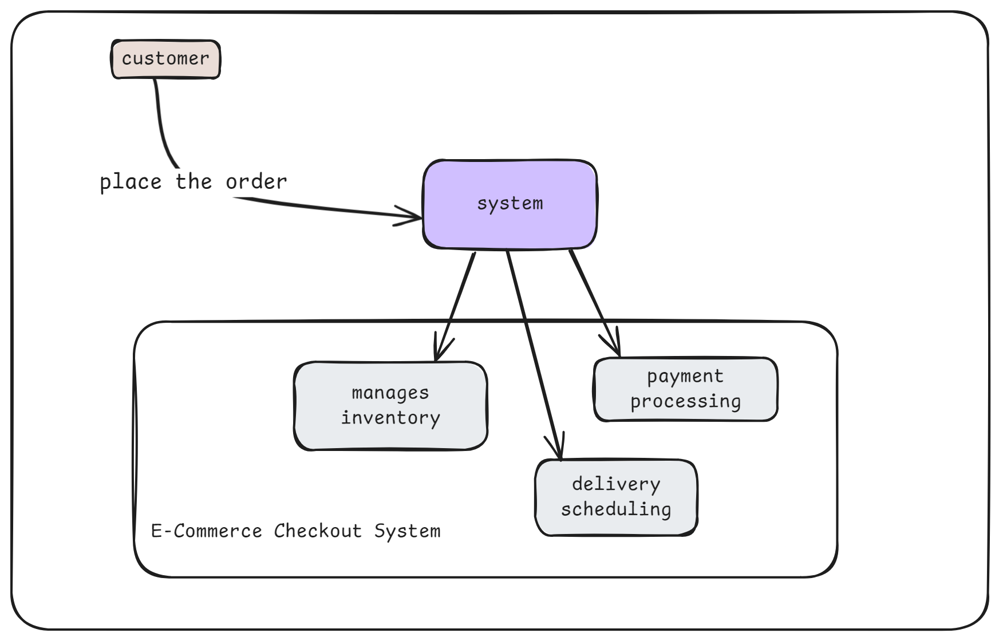
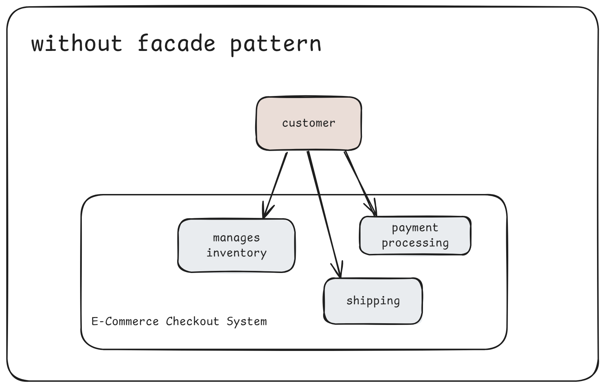
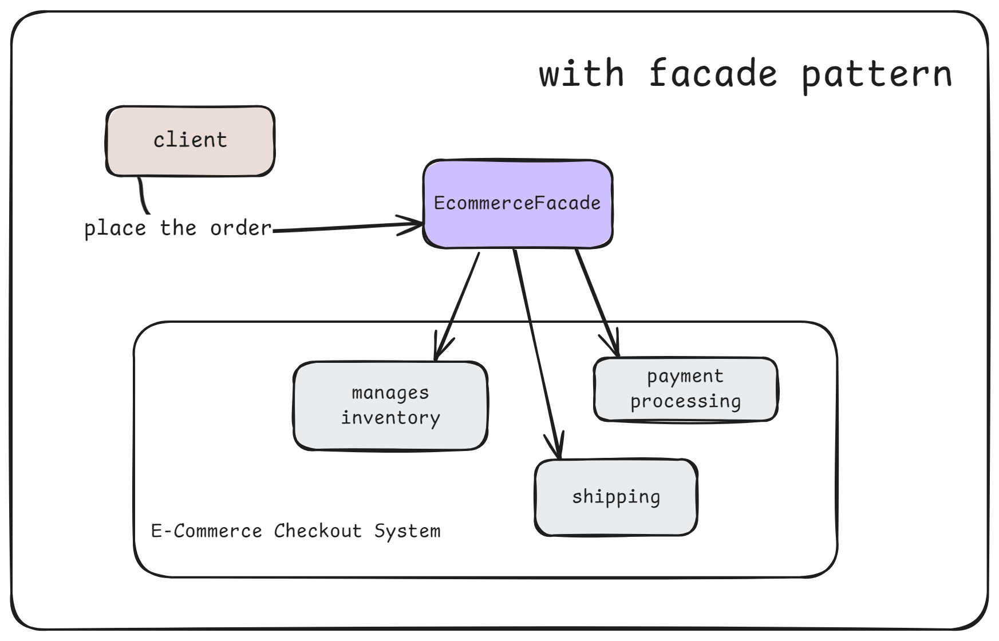
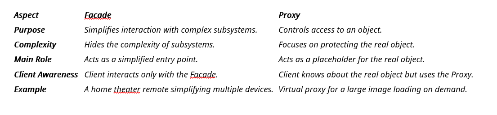

# 4. Facade Design Pattern

1. What is It?
2. Where and Why do We Use It?
3. Key Components
4. Principle Method
5. Examples of Real-World Scenario
6. Code without Pattern
7. Code with Pattern
8. Use cases of
9. Advantages & Disadvantages
10. Facade Vs Proxy

## 1. What is It?

The **Facade Design Pattern** is used to provide a simple interface to a complex system. Instead of interacting with multiple classes and their methods, the Facade offers a unified interface to the client, simplifying their work and hiding system complexities.

<p align="center">
  
</p>

## 2. Where and Why Do We Use It?

- **Where:**

  - When a system has many complex classes and operations that the client needs to interact with.
  - In layered architectures to manage communication between subsystems.

- **Why:**
  - To reduce the learning curve for users by hiding unnecessary details.
  - To make code cleaner and more readable by creating a single entry point for clients.

## 3. Key Components

<p align="center">
  
</p>

1. **Facade:** The interface that simplifies client interaction with the system.
2. **Subsystem Classes:** The internal classes that perform the actual work.
3. **Client:** The user or application that uses the Facade to interact with the system.

## 4. Principle Method

- The Facade acts as a middleman between the client and the subsystem.
- It ensures the client doesn't need to know the details of how the subsystems work.
- Clients communicate with the Facade, which delegates tasks to the subsystem classes.

## 5. Examples of Real-World Scenario

### Example: Imagine a situation where:

1. **Banking System:**
   A customer interacts with a customer service executive (Facade) for tasks like opening an account or applying for a loan. Internally, the bank handles complex processes, such as account verification and document validation.

2. **E-Commerce Checkout Process:**
   When you click "Place Order," the system (Facade) internally manages inventory, payment processing, and delivery scheduling without requiring you to handle each step.

<p align="center">
  
</p>

<p align="center">
  
</p>

## 6. Code Without Pattern

<p align="center">
  
</p>

```java
class Inventory {
    public void checkStock() {
        System.out.println("Stock is available.");
    }
}

class Payment {
    public void makePayment() {
        System.out.println("Payment is successful.");
    }
}

class Shipping {
    public void arrangeShipping() {
        System.out.println("Shipping is arranged.");
    }
}


// Client - ecommerce customer
public class WthoutFacade{
    public static void main(String[] args) {
        Inventory inventory = new Inventory();
        Payment payment = new Payment();
        Shipping shipping = new Shipping();

        inventory.checkStock();
        payment.makePayment();
        shipping.arrangeShipping();
    }
}
```

## 7. Code With Pattern

<p align="center">
  
</p>

```java
class Inventory {
    public void checkStock() {
        System.out.println("Stock is available.");
    }
}

class Payment {
    public void makePayment() {
        System.out.println("Payment is successful.");
    }
}

class Shipping {
    public void arrangeShipping() {
        System.out.println("Shipping is arranged.");
    }
}

// Facade
class ECommerceFacade {
    private Inventory inventory;
    private Payment payment;
    private Shipping shipping;

    public ECommerceFacade() {
        this.inventory = new Inventory();
        this.payment = new Payment();
        this.shipping = new Shipping();
    }

    public void placeOrder() {
        inventory.checkStock();
        payment.makePayment();
        shipping.arrangeShipping();
        System.out.println("Order placed successfully!");
    }
}

// Client
public class WithFacade{
    public static void main(String[] args) {
        ECommerceFacade ecommerce = new ECommerceFacade();
        ecommerce.placeOrder(); // Placing the order
    }
}
```

## 8. Use Cases

1. Simplifying complex APIs, such as third-party libraries.
2. Building user-friendly interfaces for applications with complicated backend operations.
3. Managing subsystems in enterprise applications like ERP and CRM.

## 9. Advantages & Disadvantages

### Advantages

      1. Simplifies client interaction by reducing system complexity.
      2. Reduces dependency between the client and subsystem classes.
      3. Enhances maintainability by decoupling subsystems from the client.

### Disadvantages:

      1. The Facade can become a "God Object" if it handles too much logic.
      2. Overuse of the Facade may limit direct access to subsystem functionality when needed.

## 10. Facade Vs Proxy

<p align="center">
  
</p>

### Proxy:

    Hides access control, and clients know about the actual system but interact with the proxy to control or manage access.

### Facade:

    Hides the complexity of subsystems, and clients don’t know about the internal subsystems; they interact only with the Facade for simplicity.
