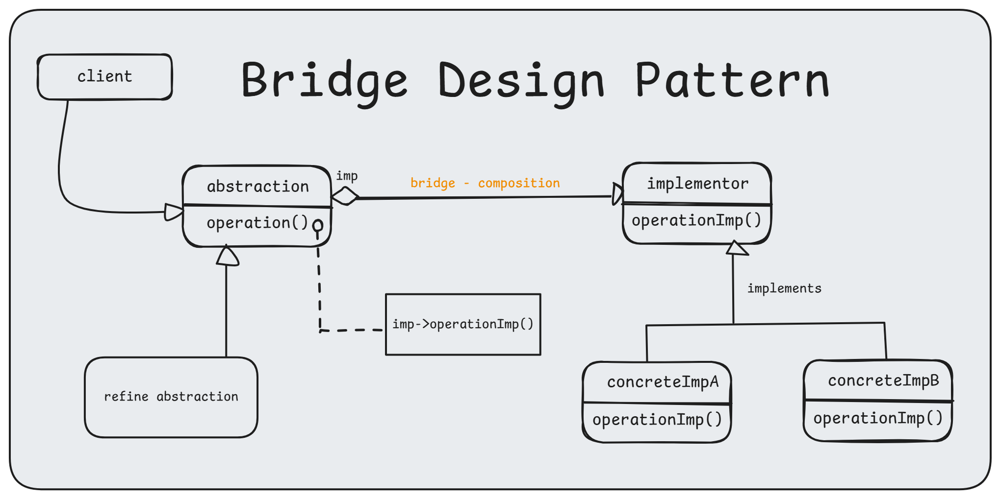

# 5. Bridge Design Pattern

1. What is It?
2. Where and Why do We Use It?
3. Key Components
4. Principle Method
5. Examples of Real-World Scenario
6. Code without Pattern
7. Code with Pattern
8. Use cases of
9. Advantages & Disadvantages

## 1. What is It?

The **bridge pattern** allows the _Abstraction_ and the _Implementation_ to be developed independently. The client code can access only the Abstraction part without being concerned about the Implementation part.

<p align="center">
  
</p>

## 2. Where and Why Do We Use It?

- **Where:**

  - When we have multiple hierarchies (e.g., devices and their remote controls).
  - When we want to decouple abstraction from implementation.

- **Why:**

  - To avoid a large number of subclasses when both the abstraction and implementation vary.
  - To increase flexibility by allowing the implementation to change without affecting the abstraction.

## 3. Key Components

1. **Abstraction:** The high-level interface that defines operations.
2. **Implementor:** The interface for implementation details.
3. **Concrete Abstraction:** Extends the abstraction and uses the Implementor.
4. **Concrete Implementor:** Implements the Implementor interface.

## 4. Principle Method

The Bridge Pattern uses composition over inheritance. Instead of creating complex hierarchies, it composes objects and connects abstraction with implementation using a bridge.

## 5. Examples of Real-World Scenario

- **TV and Remote Control:**

Different TV types (e.g., Smart TV, Old TV) can have different remotes (e.g., Basic Remote, Advanced Remote).

- **Payment Systems:**
  Online payment platforms like Razorpay or PayPal can have various payment methods (e.g., Credit Card, UPI).

## 6. Code Without Pattern

<p align="center">
  
</p>

```java
// Direct inheritance leads to class explosion
abstract class Shape {
    abstract void draw();
}

// Subclasses for each combination of shape and color
class RedCircle extends Shape {
    @Override
    void draw() {
        System.out.println("Drawing a Red Circle");
    }
}

class BlueSquare extends Shape {
    @Override
    void draw() {
        System.out.println("Drawing a Blue Square");
    }
}

// Adding a new shape or color requires creating more subclasses!
public class WithoutBridge{
    public static void main(String[] args) {
        Shape redCircle = new RedCircle();
        redCircle.draw();

        Shape blueSquare = new BlueSquare();
        blueSquare.draw();
    }
}
```

<p align="center">
  
</p>

## 7. Code With Pattern

<p align="center">
  
</p>

```java
// Step 1: Define the Color hierarchy
// Implementor: Defines the color-related behavior
interface Color {
    void applyColor();
}

// Concrete Implementors: Specific colors
class Red implements Color {
    public void applyColor() {
        System.out.println("Applying Red color");
    }
}

class Blue implements Color {
    public void applyColor() {
        System.out.println("Applying Blue color");
    }
}

// Step 2: Define the Shape hierarchy
// Abstraction: Shape links to Color via composition
abstract class Shape {
    protected Color color; // Bridge to Color (Composition)

    public Shape(Color color) {
        this.color = color;
    }

    abstract void draw(); // Abstract method for drawing
}

// Refined Abstractions: Specific shapes
class Circle extends Shape {
    public Circle(Color color) {
        super(color);
    }

    @Override
    void draw() {
        System.out.print("Drawing Circle - ");
        color.applyColor(); // Delegate color behavior
    }
}

class Square extends Shape {
    public Square(Color color) {
        super(color);
    }

    @Override
    void draw() {
        System.out.print("Drawing Square - ");
        color.applyColor(); // Delegate color behavior
    }
}

// Step 3: Use the Bridge Pattern
public class WithBridge {
    public static void main(String[] args) {
        // Create colors
        Color red = new Red();
        Color blue = new Blue();

        // Create shapes with colors
        Shape redCircle = new Circle(red);
        Shape blueSquare = new Square(blue);

        // Draw shapes
        redCircle.draw(); // Output: Drawing Circle - Applying Red color
        blueSquare.draw(); // Output: Drawing Square - Applying Blue color
    }
}
```

## 8. Use Cases

1. When you need to decouple abstraction from implementation.
2. For platforms requiring multiple implementations (e.g., device-driver communication).
3. Avoiding hierarchical complexity.

## 9. Advantages & Disadvantages

### Advantages

        1. Separation of concerns: Abstraction and implementation can evolve independently.
        2. Flexibility: Easy to introduce new abstractions or implementations.
        3. Reduced Hierarchy: Avoids a complex class hierarchy.


### Disadvantages:

        1. Increased Complexity: May introduce additional layers of abstraction.
        2. Requires Planning: Not suitable for simple use cases.

## 10. Bridge Vs Adapter

<p align="center">
  
</p>
