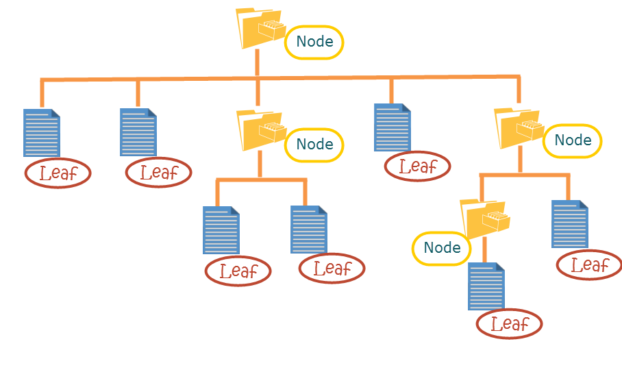
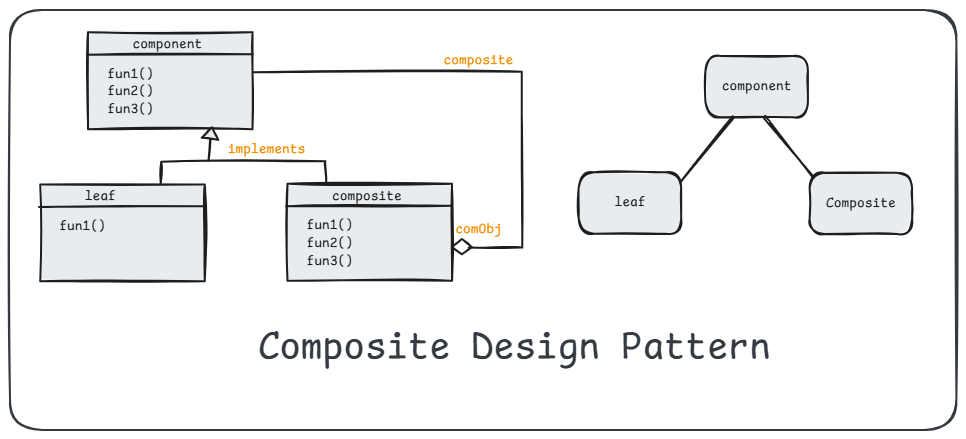

# 6. Composite Design Pattern

1. What is It?
2. Where and Why do We Use It?
3. Key Components
4. Principle Method
5. Examples of Real-World Scenario
6. Code without Pattern
7. Code with Pattern
8. Use cases of
9. Advantages & Disadvantages

## 1. What is It?

The **Composite Design Pattern** is like a tree structure. It lets you work with a group of objects in the same way you work with a single object. For example, you can treat a folder (which contains files) and a single file as the same thing. It’s part of the structural design patterns family, which deals with organizing classes and objects.

<p align="center">
  
</p>

## 2. Where and Why Do We Use It?

- **Where:**

  - When dealing with hierarchical data structures like file systems, organization charts, or UI components (buttons, panels, etc.).

- **Why?**

  - To treat individual objects (leaves) and groups of objects (composites) uniformly.
  - To simplify client code because you don’t need to worry about whether you’re working with a single item or a group.

## 3. Key Components

<p align="center">
  
</p>

1. **Component:** An abstract interface that defines common methods for both individual and composite objects.
2. **Leaf:** Represents individual objects in the structure (e.g., a single file).
3. **Composite:** Represents groups of objects that can include both leaves and other composites (e.g., a folder containing files or subfolders).
4. **Client:** Uses the objects via the component interface without worrying about their type.

## 4. Principle Method

**Recursive Composition:** The Composite design pattern allows the client to treat individual objects and compositions of objects uniformly by making the composite hold a collection of components.

## 5. Examples of Real-World Scenario

- **File System:** A folder can contain files or other folders.
- **Company Hierarchy:** A manager can manage individual employees or other managers.
- **UI Components:** A panel (composite) can contain buttons, text fields, and other panels.

## 6. Code Without Pattern

```java
import java.util.ArrayList;
import java.util.List;

// A basic file system structure without Composite Pattern
class File {
    private String name;

    public File(String name) {
        this.name = name;
    }

    public void display() {
        System.out.println("File: " + name);
    }
}

class Folder {
    private String name;
    private List<File> files = new ArrayList<>();

    public Folder(String name) {
        this.name = name;
    }

    public void addFile(File file) {
        files.add(file);
    }

    public void display() {
        System.out.println("Folder: " + name);
        for (File file : files) {
            file.display();
        }
    }
}

// Client
public class WithoutComposite {
    public static void main(String[] args) {
        File file1 = new File("File1.txt");
        File file2 = new File("File2.txt");

        Folder folder = new Folder("Documents");
        folder.addFile(file1);
        folder.addFile(file2);

        folder.display();
    }
}
```

```plantext
OUTPUT:
Folder: Documents
    File: File1.txt
    File: File2.txt
```

### Problems:

    1. Cannot treat files and folders uniformly.
    2. Adding subfolders within folders requires additional methods, increasing complexity.

## 7. Code With Pattern

```java
import java.util.ArrayList;
import java.util.List;

// Step 1: Define Component (Common Interface)
// Component
interface FileSystem {
    void display();
}


// Step 2: Define Leaf (File)
// Leaf
class File implements FileSystem {
    private String name;

    public File(String name) {
        this.name = name;
    }

    @Override
    public void display() {
        System.out.println("File: " + name);
    }
}

// Step 3: Define Composite (Folder)
// Composite
class Folder implements FileSystem {
    private String name;
    private List<FileSystem> children = new ArrayList<>();

    public Folder(String name) {
        this.name = name;
    }

    public void add(FileSystem component) {
        children.add(component);
    }

    @Override
    public void display() {
        System.out.println("Folder: " + name);
        for (FileSystem component : children) {
            component.display();
        }
    }
}


// Step 4: Use the Composite Pattern
// Client
public class WithComposite {
    public static void main(String[] args) {
        // Create files
        FileSystem file1 = new File("File1.txt");
        FileSystem file2 = new File("File2.txt");
        FileSystem file3 = new File("File3.txt");

        // Create folders
        Folder documents = new Folder("Documents");
        Folder images = new Folder("Images");

        // Build the hierarchy
        documents.add(file1);
        documents.add(file2);
        images.add(file3);

        Folder root = new Folder("Root");
        root.add(documents);
        root.add(images);

        // Display structure
        root.display();
    }
}
```

```plantext
OUTPUT:
Folder: Root
    Folder: Documents
        File: File1.txt
        File: File2.txt
    Folder: Images
        File: File3.txt
```

## 8. Use Cases

1. File Systems (folders and files).
2. Organization structures (managers and employees).
3. UI components (nested panels, buttons, text fields).

## 9. Advantages & Disadvantages

### Advantages

    1. Simplifies Code: Treats individual objects and composites uniformly.
    2. Scalability: Easy to add new types of components.
    3. Extensibility: Flexible structure for recursive compositions.

### Disadvantages
    1. Overhead: Adds complexity for simple structures.
    2. Tight Coupling: Component classes are tightly connected.