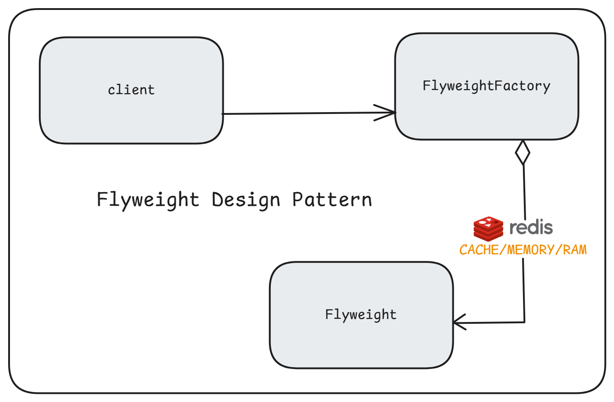
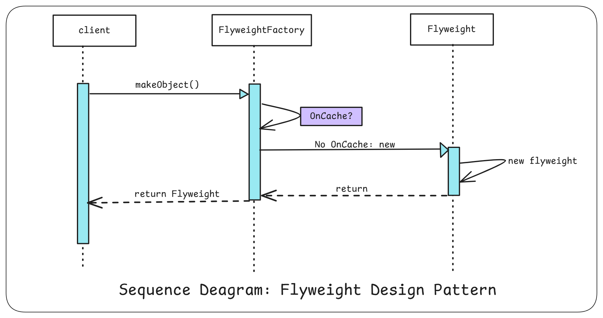
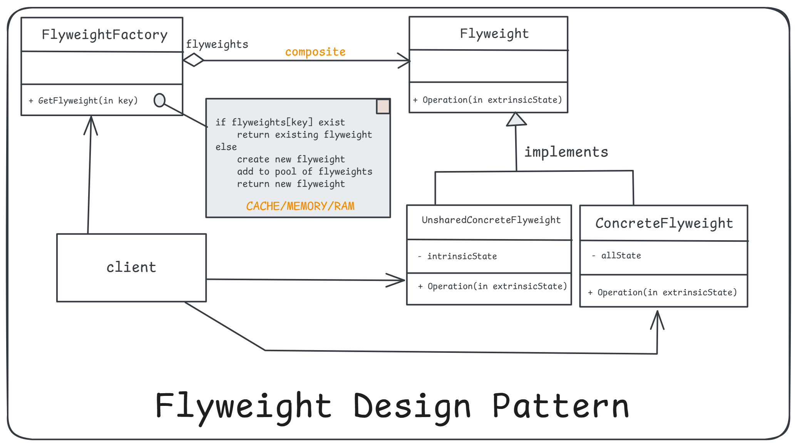

# 7. Flyweight Design Pattern

1. What is It?
2. Where and Why do We Use It?
3. Key Components
4. Principle Method
5. Examples of Real-World Scenario
6. Code without Pattern
7. Code with Pattern
8. Use cases of
9. Advantages & Disadvantages

## 1. What is It?

The **Flyweight Design Pattern** is used to reduce memory usage and improve performance by sharing common parts of objects instead of creating separate objects for every instance. It allows the reuse of objects that share similar data.

<p align="center">
  
</p>
<p align="center">
  
</p>

## 2. Where and Why Do We Use It?

We use the Flyweight pattern when:

- We have a large number of objects, and most of them share common data.
- To minimize memory consumption by reusing existing objects.
- For applications like text editors, graphical applications, or games where repeated elements (e.g., characters or shapes) are involved.

**For example**, in a text editor, every character on the screen can share the same font data, colour, and size instead of creating individual objects for each character.

## 3. Key Components

<p align="center">
  
</p>

1. **Flyweight Interface:** Defines common methods for all shared objects.
2. **Concrete Flyweight:** Implements the Flyweight interface and represents shared data.
3. **Unshared Flyweight:** Represents unique data that cannot be shared.
4. **Flyweight Factory:** Ensures the sharing of flyweight objects. It manages object creation and reuse.
5. **Client:** Uses flyweight objects.

## 4. Principle Method

The Flyweight pattern separates intrinsic data (**shared**) from extrinsic data (**unique**) and combines them to form an object. Intrinsic data is stored in the flyweight object, while extrinsic data is passed by the client.

## 5. Examples of Real-World Scenario

- **Text Editor:** Characters on a document reuse font, colour, and size data.
- **Game Development:** Trees in a forest share their appearance but have unique positions.
- **Graphical Applications:** Icons in applications like IDEs or dashboards reuse designs.

## 6. Code Without Pattern

In this example, every circle is created as a separate object.

```java
class Circle {
    private String color;
    private int x, y, radius;

    public Circle(String color, int x, int y, int radius) {
        this.color = color;
        this.x = x;
        this.y = y;
        this.radius = radius;
    }

    public void draw() {
        System.out.println("Drawing Circle: Color: " + color + ", X: " + x + ", Y: " + y + ", Radius: " + radius);
    }
}

public class WithoutFlyweight {
    public static void main(String[] args) {
        Circle circle1 = new Circle("Red", 10, 20, 30);
        Circle circle2 = new Circle("Blue", 15, 25, 35);
        Circle circle3 = new Circle("Red", 50, 60, 70);
        
        circle1.draw();
        circle2.draw();
        circle3.draw();
    }
}
```

```plantext
Output:
Drawing Circle: Color: Red, X: 10, Y: 20, Radius: 30
Drawing Circle: Color: Blue, X: 15, Y: 25, Radius: 35
Drawing Circle: Color: Red, X: 50, Y: 60, Radius: 70
```

### Problems:

    Every object is stored separately, leading to high memory usage for repeated properties like colour.

## 7. Code With Pattern

Here, we share the "Colour" part among circles.

```java
import java.util.HashMap;
import java.util.Map;

// Flyweight Interface
interface Shape {
    void draw(int x, int y, int radius);
}

// Concrete Flyweight
class Circle implements Shape {
    private final String color;

    public Circle(String color) {
        this.color = color;
    }

    @Override
    public void draw(int x, int y, int radius) {
        System.out.println("Drawing Circle: Color: " + color + ", X: " + x + ", Y: " + y + ", Radius: " + radius);
    }
}

// Flyweight Factory
class ShapeFactory {
    private static final Map<String, Shape> circleMap = new HashMap<>();

    // CACHE/POOL/MEMORY/RAM: SHARED OBJECTS
    public static Shape getCircle(String color) {
        Shape circle = circleMap.get(color);

        if (circle == null) {
            circle = new Circle(color);
            circleMap.put(color, circle);
            System.out.println("Creating Circle of color: " + color);
        }
        return circle;
    }
}

// Client
public class WithFlyweight {
    public static void main(String[] args) {
        Shape redCircle = ShapeFactory.getCircle("Red");
        redCircle.draw(10, 20, 30);

        Shape blueCircle = ShapeFactory.getCircle("Blue");
        blueCircle.draw(15, 25, 35);

        Shape anotherRedCircle = ShapeFactory.getCircle("Red");
        anotherRedCircle.draw(50, 60, 70);
    }
}
```

```plantext
Output:
Creating Circle of color: Red
Drawing Circle: Color: Red, X: 10, Y: 20, Radius: 30
Creating Circle of color: Blue
Drawing Circle: Color: Blue, X: 15, Y: 25, Radius: 35
Drawing Circle: Color: Red, X: 50, Y: 60, Radius: 70
```

### Solution:

        Red circles share the same "Red" object, reducing memory usage.

## 8. Use Cases

1. Text Editors: Reusing character fonts and formatting.
2. Graphics: Managing repeated elements like trees or houses in games.
3. Database Connections: Sharing connection pools to avoid creating multiple connections.
4. IDEs: Reusing icons for buttons, tabs, or menus.

## 9. Advantages & Disadvantages

### Advantages

        1. Saves memory by reusing objects.
        2. Reduces object creation overhead.
        3. Improves performance for applications with many similar objects.
    
### Disadvantages:

        1. Increased complexity due to managing shared objects.
        2. Extrinsic data must be provided by the client, adding responsibility to the client.
