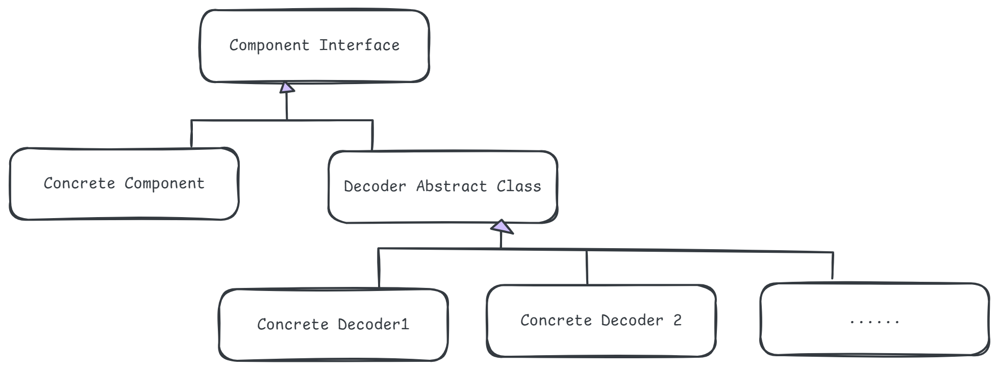
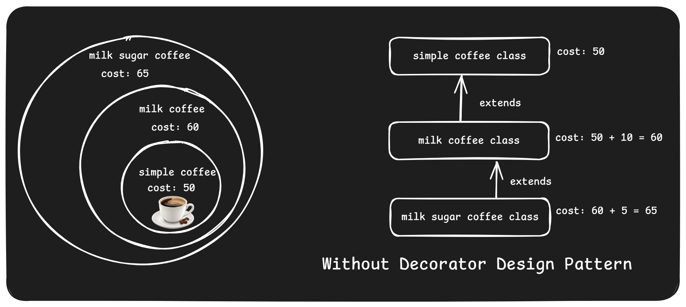
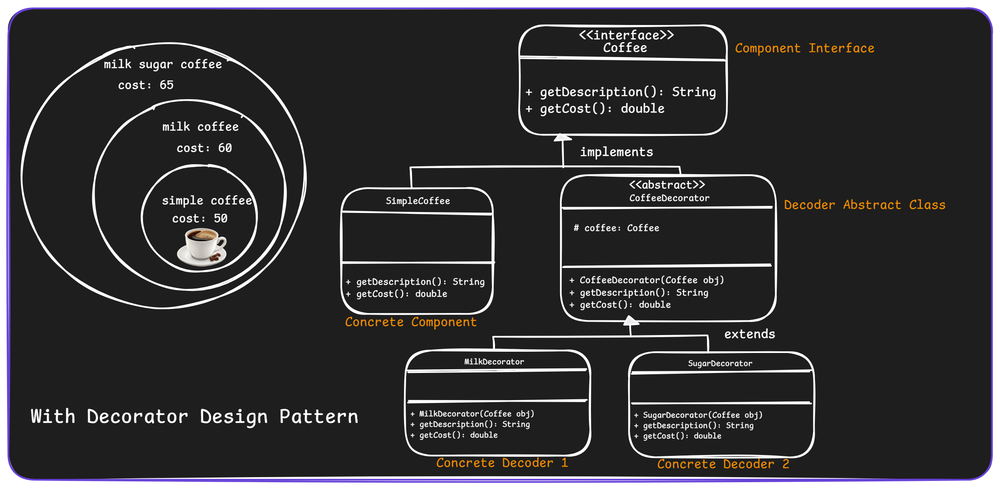

# 1. Decorator Design Pattern

1. What is It?
2. Where and Why do We Use It?
3. Key Components
4. Principle Method
5. Examples of Real-World Scenario
6. Code without Pattern
7. Code with Pattern
8. Use cases of
9. Advantages & Disadvantages

## 1. What is It?

The **Decorator Design Pattern** is a way to add new features or functionality to an object without changing its original code. Think of it like adding layers (decorations) to a cake each layer adds something extra while keeping the base intact.

<p align="center">
  
</p>

## 2. Where and Why Do We Use It?

- **Where:**
  - When you want to add new behaviors to objects without modifying their code.
  - When you want to avoid creating too many subclasses for different combinations of features.
- **Why:**
  - To follow the Open/Closed Principle (open for extension, closed for modification).
  - To allow flexibility in adding or combining features at runtime.

## 3. Key Components

<p align="center">
  
</p>

1. **Component:** The main interface or abstract class defining the structure.
2. **Concrete Component:** The base object whose behavior will be enhanced.
3. **Decorator:** An abstract class or interface that wraps the component and provides additional features.
4. **Concrete Decorators:** Actual implementations of the decorators that add specific functionality.

## 4. Principle Method

The pattern works by:

- Using composition instead of inheritance.
- Wrapping an object inside another object (decorator) to add new behaviors.

## 5. Examples of Real-World Scenario

Imagine you're buying coffee at a café:

- You start with a basic coffee.
- You add milk, sugar, and whipped cream _one by one_.
- The coffee's price and description update dynamically without changing its original preparation process.

## 6. Code Without Pattern

In this approach, we would create multiple classes for every possible coffee combination.

<p align="center">
  
</p>

```java
class SimpleCoffee {
    public String getDescription() {
        return "Simple Coffee";
    }

    public double getCost() {
        return 50.0;
    }
}

class MilkCoffee extends SimpleCoffee {
    @Override
    public String getDescription() {
        return super.getDescription() + ", Milk";
    }

    @Override
    public double getCost() {
        return super.getCost() + 10.0;
    }
}

class MilkSugarCoffee extends MilkCoffee {
    @Override
    public String getDescription() {
        return super.getDescription() + ", Sugar";
    }

    @Override
    public double getCost() {
        return super.getCost() + 5.0;
    }
}

// Main Class
public class CoffeeWithoutPattern {
    public static void main(String[] args) {
        MilkSugarCoffee coffee = new MilkSugarCoffee();
        System.out.println(coffee.getDescription() + " -> Cost: " + coffee.getCost());
    }
}
```

Problems:

1. Too many classes for every combination.
2. Hard to maintain or extend.

## 7. Code With Pattern

Using the Decorator Pattern, we create a flexible system.

<p align="center">
  
</p>

```java
// Step 1: Create the Component Interface
interface Coffee {
    String getDescription();
    double getCost();
}

// Step 2: Base Coffee Implementation
class SimpleCoffee implements Coffee {
    @Override
    public String getDescription() {
        return "Simple Coffee";
    }

    @Override
    public double getCost() {
        return 50.0;
    }
}

// Step 3: Abstract Decorator
abstract class CoffeeDecorator implements Coffee {
    protected Coffee coffee;

    public CoffeeDecorator(Coffee coffee) {
        this.coffee = coffee;
    }

    @Override
    public String getDescription() {
        return coffee.getDescription();
    }

    @Override
    public double getCost() {
        return coffee.getCost();
    }
}

// Step 4: Concrete Decorators
class MilkDecorator extends CoffeeDecorator {
    public MilkDecorator(Coffee coffee) {
        super(coffee);
    }

    @Override
    public String getDescription() {
        return coffee.getDescription() + ", Milk";
    }

    @Override
    public double getCost() {
        return coffee.getCost() + 10.0;
    }
}

class SugarDecorator extends CoffeeDecorator {
    public SugarDecorator(Coffee coffee) {
        super(coffee);
    }

    @Override
    public String getDescription() {
        return coffee.getDescription() + ", Sugar";
    }

    @Override
    public double getCost() {
        return coffee.getCost() + 5.0;
    }
}

// Step 5: Client Code
public class CoffeeWithPattern {
    public static void main(String[] args) {
        Coffee coffee = new SimpleCoffee();
        coffee = new MilkDecorator(coffee);
        coffee = new SugarDecorator(coffee);

        System.out.println(coffee.getDescription() + " -> Cost: " + coffee.getCost());
    }
}
```

## 8. Use Cases

1. Adding toppings to food items (e.g., pizzas, burgers, coffee).
2. Extending the functionality of graphical components in UI design.
3. Adding responsibilities to logging, such as timestamps or formats.
4. Enhancing streams in Java I/O (e.g., BufferedReader wrapping a Reader).

## 9. Advantages & Disadvantages

### Advantages

    1. Flexibility: Add/remove features dynamically.
    2. Scalability: Combine multiple decorators as needed.
    3. Single Responsibility: Each decorator has a specific job.

### Disadvantages:

    1. Complexity: Wrapping objects repeatedly can become complicated.
    2. Overhead: Too many small objects (decorators) may impact performance.
