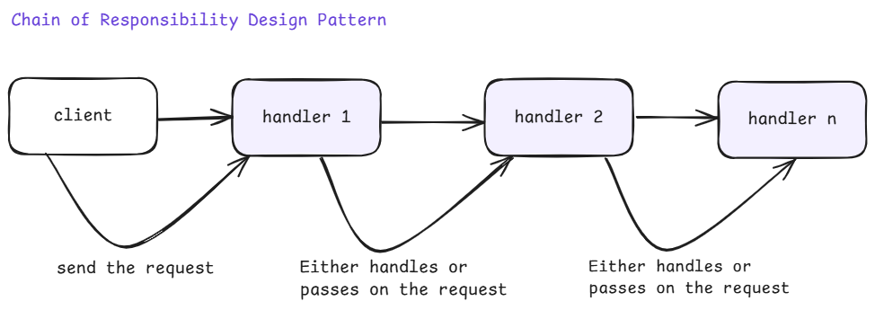
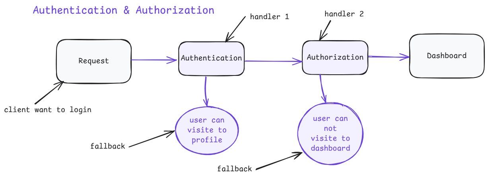
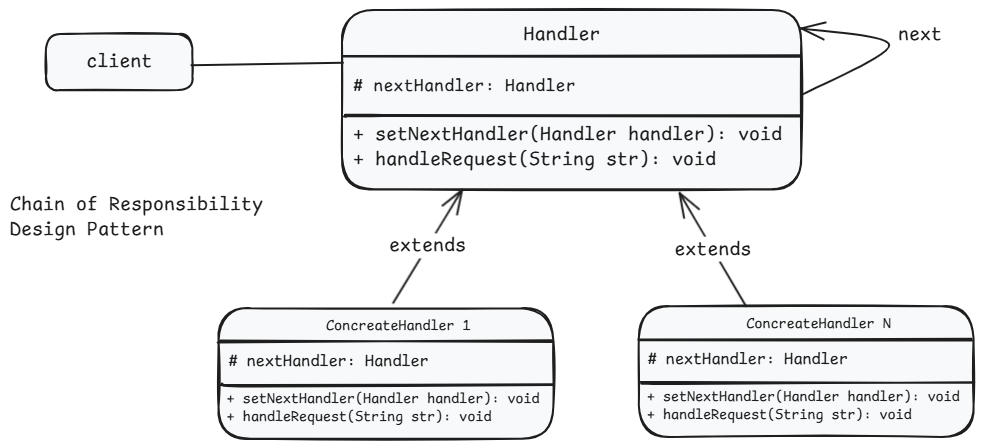

# 1. Chain of Responsibility Design Pattern

1. What is It?
2. Where and Why do We Use It?
3. Characteristics of the Chain of Responsibility Design Pattern
4. Key Components
5. Principle Method
6. Examples of Real-World Scenario
7. Code without Pattern
8. Code with Pattern
9. Use cases of
10. Advantages & Disadvantages
11. Conclusion

## 1. What is It?

The **Chain of Responsibility is a design pattern** where a request is passed along a chain of handlers until one of them processes it. Each handler in the chain decides whether to handle the request or pass it to the next handler.

<p align="center">
  
</p>

## 2. Where and Why Do We Use It?

### We use this pattern when:

1. Multiple objects can handle a request, but the specific handler is unknown.
2. We want to decouple the sender and receiver of a request.
3. We want to process requests dynamically at runtime.

### Example:

In a support ticket system, a request first goes to a customer service agent. If they can’t handle it, it moves to a supervisor, and then to the manager.

## 3. Characteristics of the Chain of Responsibility Design Pattern

1. **Loose Coupling** – The sender doesn’t need to know which handler will process the request, keeping components flexible.
2. **Dynamic Chain** – Handlers can be added or removed at runtime without modifying the main code.
3. **Single Responsibility** – Each handler either processes the request or passes it forward, keeping the code organized.
4. **Sequential Order** – Requests move step by step through the chain, ensuring structured processing.
5. **Fallback Mechanism** – If no handler processes the request, a default action can handle it.

<p align="center">
  
</p>

## 4. Key Components

<p align="center">
  
</p>

1. **Handler (Abstract Class or Interface)** – Defines a method to handle requests.
2. **Concrete Handlers** – Actual classes that process the request or pass it to the next handler.
3. **Client** – Sends the request to the first handler in the chain.

## 5. Principle Method

The request is processed step by step in a sequence, where:

1. Each handler either processes the request or passes it to the next handler.
2. The chain ensures that the request is handled by the correct handler.

## 6. Examples of Real-World Scenario

1. **Technical Support System** – A support request is passed from Level 1 → Level 2 → Manager.
2. **ATM Withdrawal** – The machine processes withdrawals in different denominations (₹2000, ₹500, ₹200, ₹100).
3. **Approval Workflow** – An expense approval process where approval moves from Employee → Team Lead → Manager → CEO.

## 7. Code Without Pattern (Tightly Coupled Code)

Here, every handler is hardcoded, making the code difficult to scale.

```java
class HelpDesk {
    public void handleRequest(String issue) {
        if (issue.equals("Basic")) {
            System.out.println("Handled by Customer Support.");
        } else if (issue.equals("Intermediate")) {
            System.out.println("Handled by Supervisor.");
        } else if (issue.equals("Critical")) {
            System.out.println("Handled by Manager.");
        } else {
            System.out.println("No one can handle this request.");
        }
    }
}

public class WithoutChainRDP {
    public static void main(String[] args) {
        HelpDesk helpDesk = new HelpDesk();
        helpDesk.handleRequest("Intermediate");
        helpDesk.handleRequest("Critical");
    }
}
```

Problems:

1. If we add a new level (e.g., "Director"), we need to modify handleRequest(), making it hard to maintain.
2. The logic is tightly coupled.

## 8. Code With Pattern (Flexible & Scalable)

Here, each handler decides whether to process or pass the request to the next handler.

```java
// Step 1: Create an abstract Handler
abstract class SupportHandler {
    protected SupportHandler nextHandler;

    public void setNextHandler(SupportHandler nextHandler) {
        this.nextHandler = nextHandler;
    }

    public abstract void handleRequest(String issue);
}

// Step 2: Create Concrete Handlers
class CustomerSupport extends SupportHandler {
    public void handleRequest(String issue) {
        if (issue.equals("Basic")) {
            System.out.println("Customer Support: Handling the issue.");
        } else if (nextHandler != null) {
            nextHandler.handleRequest(issue);
        }
    }
}

class Supervisor extends SupportHandler {
    public void handleRequest(String issue) {
        if (issue.equals("Intermediate")) {
            System.out.println("Supervisor: Handling the issue.");
        } else if (nextHandler != null) {
            nextHandler.handleRequest(issue);
        }
    }
}

class Manager extends SupportHandler {
    public void handleRequest(String issue) {
        if (issue.equals("Critical")) {
            System.out.println("Manager: Handling the issue.");
        } else {
            System.out.println("No one can handle this request.");
        }
    }
}

// Step 3: Client Code
public class WithChainRDP {
    public static void main(String[] args) {
        SupportHandler customerSupport = new CustomerSupport();
        SupportHandler supervisor = new Supervisor();
        SupportHandler manager = new Manager();

        // Form the chain
        customerSupport.setNextHandler(supervisor);
        supervisor.setNextHandler(manager);

        // Send requests
        customerSupport.handleRequest("Basic"); // Output: Customer Support: Handling the issue
        customerSupport.handleRequest("Intermediate"); // Output: Supervisor: Handling the issue
        customerSupport.handleRequest("Critical"); // Output: Manager: Handling the issue
    }
}
```

Why is this better?

1. **Flexible** – Adding a new handler (e.g., "Director") is easy.
2. **Scalable** – We don’t modify existing classes, just extend them.
3. **Decoupled Code** – The client does not care who processes the request.

## 9. Use Cases of Chain of Responsibility

1. **Logging Framework** – Logs go from Debug → Info → Warning → Error handlers.
2. **Security Filters** – Authentication is checked in steps (e.g., Token → Role Check → Permission Check).
3. **Middleware** – Used in Express.js and Spring Boot to process HTTP requests.

## 10. Advantages & Disadvantages

### Advantages

        1. Reduces Coupling: The sender and receiver are independent.
        2. Flexible: Easily add new handlers without modifying existing ones.
        3. Better Responsibility Distribution: Each handler has a clear role.

### Disadvantages

        1. Not Guaranteed to Process Requests: If no handler processes a request, it may be lost.
        2. Difficult to Debug: When chains get long, debugging can be complex.
        3. Performance Overhead: If the chain is long, it can slow down request processing.

## Conclusion

The Chain of Responsibility Pattern is useful when multiple handlers can process a request but only one should handle it. It provides flexibility and scalability, making systems easy to extend.
