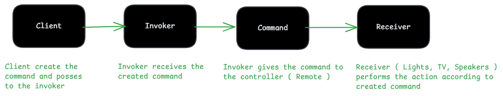
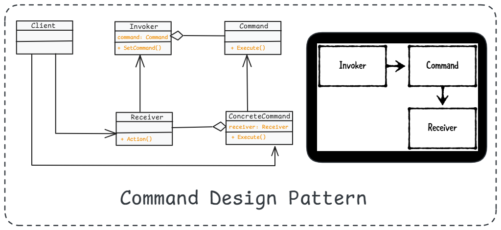
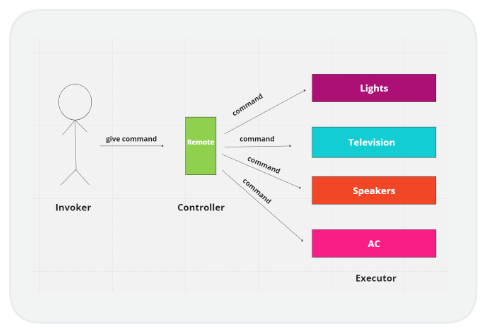

# 2. Command Design Pattern

1. What is It?
2. Where and Why do We Use It?
3. Key Components
4. Principle Method
5. Examples of Real-World Scenario
6. Code without Pattern
7. Code with Pattern
8. Use cases of
9. Advantages & Disadvantages
10. Conclusion

## 1. What is It?

The **Command Design Pattern** is used to encapsulate a request as an object ( This object contains all information about the request ), allowing you to parameterize clients with different requests, queue them, and support undo operations. It separates the sender and receiver of a request, making the system more flexible.

<p align="center">
  
</p>

## 2. Where and Why Do We Use It?

### Where?

1. GUI-based applications (Undo/Redo operations)
2. Remote controls (TV, AC)
3. Task scheduling (Job queues)

### Why?

1. It allows executing commands later (delayed execution).
2. Supports undo/redo functionality.
3. Decouples the sender and receiver for better flexibility.

## 3. Key Components

<p align="center">
  
</p>

1. **Command Interface** – Defines the execution method.
2. **Concrete Command** – Implements the command interface and defines execution logic.
3. **Receiver** – The actual object performing the action.
4. **Invoker** – Calls the command (e.g., a button click).
5. **Client** – Creates and sets up the command.

## 4. Principle Method

- The sender (Invoker) calls a method on a command object.
- The command object delegates the request to the Receiver.
- The receiver performs the actual action.

## 5. Examples of Real-World Scenario

### Example 1: Remote Control System

- A remote has multiple buttons (Invoker).
- Each button is assigned a command (Concrete Command).
- The command instructs the TV or AC (Receiver) to perform an action.

### Example 2: Text Editor (Undo/Redo Feature)

- Actions like typing, deleting, or formatting are stored as command objects.
- Undo operation reverses the last command.

<p align="center">
  
</p>

## 6. Code Without Pattern (Tightly Coupled Code)

```java
class Light {
    public void turnOn() {
        System.out.println("Light is ON");
    }
    
    public void turnOff() {
        System.out.println("Light is OFF");
    }
}

class Switch {
    private Light light;
    
    public Switch(Light light) {
        this.light = light;
    }
    
    public void pressOn() {
        light.turnOn();
    }
    
    public void pressOff() {
        light.turnOff();
    }
}

public class WithoutCommandPattern {
    public static void main(String[] args) {
        Light light = new Light();
        Switch switchBtn = new Switch(light);
        
        switchBtn.pressOn(); // Light is ON
        switchBtn.pressOff(); // Light is OFF
    }
}
```

Problems Without Pattern:

- The Switch class is tightly coupled to Light.
- If we want to add new devices (e.g., Fan, TV), we need to modify Switch.

## 7. Code With Pattern (Flexible & Scalable)

Here, each handler decides whether to process or pass the request to the next handler.

```java
// Step 1: Command Interface
interface Command {
    void execute();
}

// Step 2: Concrete Commands
class LightOnCommand implements Command {
    private Light light;
    
    public LightOnCommand(Light light) {
        this.light = light;
    }
    
    @Override
    public void execute() {
        light.turnOn();
    }
}

class LightOffCommand implements Command {
    private Light light;
    
    public LightOffCommand(Light light) {
        this.light = light;
    }
    
    @Override
    public void execute() {
        light.turnOff();
    }
}

// Step 3: Receiver (Light)
class Light {
    public void turnOn() {
        System.out.println("Light is ON");
    }
    
    public void turnOff() {
        System.out.println("Light is OFF");
    }
}

// Step 4: Invoker (Switch)
class Switch {
    private Command command;
    
    public void setCommand(Command command) {
        this.command = command;
    }
    
    public void pressButton() {
        command.execute();
    }
}

// Step 5: Client
public class WithCommandPattern {
    public static void main(String[] args) {
        Light light = new Light();
        
        Command lightOn = new LightOnCommand(light);
        Command lightOff = new LightOffCommand(light);
        
        Switch switchBtn = new Switch();
        
        switchBtn.setCommand(lightOn);
        switchBtn.pressButton();  // Light is ON
        
        switchBtn.setCommand(lightOff);
        switchBtn.pressButton();  // Light is OFF
    }
}
```

Benefits of Using Command Pattern:

- **Extensibility:** Can add new commands without modifying existing code.
- **Decoupling:** Sender (Switch) and Receiver (Light) are independent.
- **Undo/Redo Support:** Store executed commands and reverse actions.

## 8. Use Cases of Command Pattern

- **GUI applications** (Undo/Redo operations in text editors).
- **Remote controls** (Each button triggers a specific command).
- **Macro recording** (Executing a sequence of commands).
- **Job scheduling** systems (Queueing tasks to be executed later).

## 9. Advantages & Disadvantages

### Advantages

        1. Loose coupling between sender and receiver.
        2. Supports undo/redo operations.
        3. Allows delayed execution of requests.
        4. Easily extendable (new commands without modifying existing code).

### Disadvantages

        1. Increases the number of classes (more objects to manage).
        2. Can add unnecessary complexity if not needed.

## Conclusion

The Command Pattern is useful in situations where actions need to be encapsulated as objects. It simplifies code by decoupling sender and receiver, making the system more flexible and extensible.
