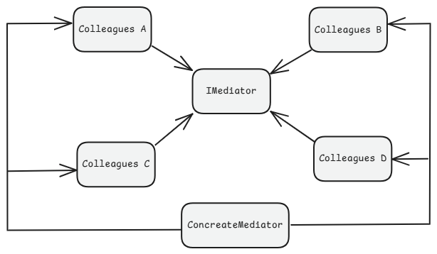

# 3. Mediator Design Pattern

1. What is It?
2. Where and Why do We Use It?
3. Key Components
4. Principle Method
5. Examples of Real-World Scenario
6. Code without Pattern
7. Code with Pattern
8. Use cases of
9. Advantages & Disadvantages
10. Conclusion

## 1. What is It?

The **Mediator Design Pattern** is used to reduce direct communication between multiple objects. Instead of objects interacting with each other directly, they communicate through a **mediator**, which acts as a middleman. This helps in reducing dependencies between objects, making the system easier to manage.

<p align="center">
  
</p>

## 2. Where and Why Do We Use It?

### Where?

1. Chat applications (WhatsApp, Slack)
2. Air traffic control systems
3. Messaging systems (Notification services)

### Why?

1. Avoids complex object-to-object dependencies.
2. Simplifies communication between multiple objects.
3. Makes it easier to modify and extend the system.

## 3. Key Components

<p align="center">
  
</p>

1. **Mediator Interface** – Defines how objects interact through a common interface.
2. **Concrete Mediator** – Implements the mediator interface and coordinates communication.
3. **Colleagues (Objects)** – These are the objects that interact using the mediator.

## 4. Principle Method

- Colleague objects do not communicate directly.
- Instead, they send messages to the **mediator**.
- The **mediator** then forwards the message to the relevant object.

## 5. Examples of Real-World Scenario

### Example 1: Chat Room

- Users (Colleagues) do not message each other directly.
- Instead, they send messages to a chat room (Mediator), which delivers them to the correct recipient.

### Example 2: Air Traffic Control (ATC)

- Airplanes (Colleagues) do not communicate with each other directly.
- Instead, they communicate via the ATC Tower (Mediator), which ensures safe take-offs and landings.

<p align="center">
  
</p>

<p align="center">
  
</p>

## 6. Code Without Pattern (Tightly Coupled Code)

<p align="center">
  
</p>

```java
class User {
    private String name;

    public User(String name) {
        this.name = name;
    }

    public void sendMessage(User receiver, String message) {
        System.out.println(this.name + " sends: " + message + " to " + receiver.getName());
        receiver.receiveMessage(message);
    }

    public void receiveMessage(String message) {
        System.out.println(name + " received: " + message);
    }

    public String getName() {
        return name;
    }
}

public class WithoutMediatorPattern {
    public static void main(String[] args) {
        User user1 = new User("Raj");
        User user2 = new User("Amit");

        user1.sendMessage(user2, "Hello");
        user2.sendMessage(user1, "Ha Bol");
    }
}

/*
OUTPUT:
Raj sends: Hello to Amit
Amit received: Hello
Amit sends: Ha Bol to Raj
Raj received: Ha Bol
*/
```

Problems Without Pattern:

- If we add more users, communication becomes complex.
- Objects are tightly coupled, making modifications difficult.

## 7. Code With Pattern (Flexible & Scalable)

<p align="center">
  
</p>

```java
// Step 1: Mediator Interface
interface ChatMediator {
    void sendMessage(String message, User user);
}

// Step 2: Concrete Mediator
class ChatRoom implements ChatMediator {
    @Override
    public void sendMessage(String message, User user) {
        System.out.println(user.getName() + " sent: " + message);
    }
}

// Step 3: Colleague (User)
class User {
    private String name;
    private ChatMediator mediator;

    public User(String name, ChatMediator mediator) {
        this.name = name;
        this.mediator = mediator;
    }

    public void sendMessage(String message) {
        mediator.sendMessage(message, this);
    }

    public String getName() {
        return name;
    }
}

// Step 4: Client
public class WithMediatorPattern {
    public static void main(String[] args) {
        ChatMediator chatRoom = new ChatRoom();

        User amit = new User("Amit", chatRoom);
        User raj = new User("Raj", chatRoom);

        amit.sendMessage("Hello, Raj!");
        raj.sendMessage("Hi, Amit!");
    }
}
```

Benefits of Using Mediator Pattern:

- **Loose coupling:** Users don’t directly interact, making it easier to modify.
- **Scalability:** Adding more users doesn’t complicate the system.
- **Centralized communication:** Chat room manages all messages.

## 8. Use Cases of Mediator Pattern

- **Chat applications** (WhatsApp, Facebook Messenger).
- **Air traffic control systems** (Ensuring safe communication between pilots).
- **Notification systems** (One system notifying multiple services).
- **Stock exchange** (Brokers communicate through a central exchange).

## 9. Advantages & Disadvantages

### Advantages

        1. Reduces direct dependencies between objects.
        2. Easy to modify or extend without changing multiple classes.
        3. Centralized communication improves maintainability.

### Disadvantages

        1. If too many rules are handled by the mediator, it can become a bottleneck.
        2. Can introduce complexity if used unnecessarily.

## Conclusion

The Mediator Pattern is useful in scenarios where multiple objects need to communicate without directly referencing each other. It makes the system more scalable, maintainable, and flexible.

**Note: Lean About Multithreading & Async and Sync Concept Using Java, C++, etc.**
