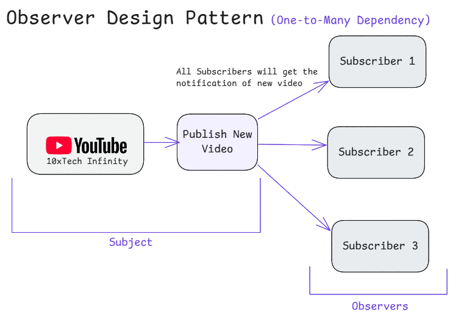
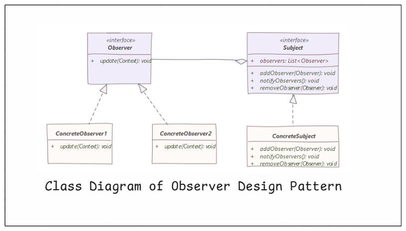

# 4. Observer Design Pattern

1. What is It?
2. Where and Why do We Use It?
3. Key Components
4. Principle Method
5. Examples of Real-World Scenario
6. Code without Pattern
7. Code with Pattern
8. Use cases of
9. Advantages & Disadvantages
10. Steps to Implement ( YouTube channel subscription system )
11. Conclusion

## 1. What is It?

The **Observer Design Pattern** is used when one object (called the **Subject**) needs to notify multiple objects (**Observers**) about changes in its state. This allows for a **one-to-many** dependency between objects, meaning that when the Subject changes, all registered Observers get updated automatically.

<p align="center">
  
</p>

## 2. Where and Why Do We Use It?

### Where?

- **Event-driven systems** (e.g., UI button clicks, notifications)
- **Stock market apps** (Users get updates when stock prices change)
- **Weather updates** (Subscribers get notified about temperature changes)
- **Messaging apps** (WhatsApp status updates)

### Why?

- Automatically updates multiple objects when something changes.
- Reduces direct dependencies between objects (Loose Coupling).
- Useful when multiple parts of an application need to react to changes.

## 3. Key Components

<p align="center">
  
</p>

1. **Subject (Publisher)**: The main object that maintains a list of Observers and notifies them when changes happen.
2. **Observers (Subscribers)**: Objects that are registered to receive updates from the Subject.
3. **Concrete Subject**: The actual implementation of the Subject that holds data and notifies Observers.
4. **Concrete Observers**: The objects that act upon the updates received from the Subject.

## 4. Principle Method

- Observers register themselves to the Subject.
- When the state of the Subject changes, it notifies all registered Observers.
- Observers update themselves accordingly.

## 5. Examples of Real-World Scenario

### Example 1: YouTube Channel Subscription

- You (**Observer**) subscribe to a YouTube channel (**Subject**).
- When the YouTuber uploads a new video, you automatically get notified.

### Example 2: Weather Monitoring System

- Multiple devices (**Observers**) get live weather updates from a central weather station (**Subject**)

## 6. Code Without Pattern (Tightly Coupled Code)

```java
class WeatherStation {
    private int temperature;

    public void setTemperature(int temperature) {
        this.temperature = temperature;
        System.out.println("Weather Station: New temperature is " + temperature);
    }

    public int getTemperature() {
        return temperature;
    }
}

class PhoneDisplay {
    private WeatherStation station;

    public PhoneDisplay(WeatherStation station) {
        System.out.println("Phone Display: Temperature updated to " + station.getTemperature());
    }

    public void update() {
        System.out.println("Phone Display: Temperature updated to " + station.getTemperature());
    }
}

public class WithoutObserverPattern {
    public static void main(String[] args) {
        WeatherStation station = new WeatherStation();
        new PhoneDisplay(station);

        station.setTemperature(30); // Only updates station, not display
    }
}
/*
OUTPUT:
Phone Display: Temperature updated to 0
Weather Station: New temperature is 30
*/
```

Problems Without Pattern:

- **No automatic updates** – The display doesn’t change unless manually refreshed.
- **Tightly coupled code** – The display is directly dependent on WeatherStation.
- **Adding more displays** – Would require modifying WeatherStation, making it harder to maintain.

## 7. Code With Pattern (Flexible & Scalable)

```java
import java.util.ArrayList;
import java.util.List;

// Step 1: Observer Interface
interface Observer {
    void update(int temperature);
}

// Step 2: Subject Interface
interface Subject {
    void addObserver(Observer observer);
    void removeObserver(Observer observer);
    void notifyObservers();
}

// Step 3: Concrete Subject (WeatherStation)
class WeatherStation implements Subject {
    private int temperature;
    private List<Observer> observers = new ArrayList<>();

    @Override
    public void addObserver(Observer observer) {
        observers.add(observer);
    }

    @Override
    public void removeObserver(Observer observer) {
        observers.remove(observer);
    }

    @Override
    public void notifyObservers() {
        for (Observer observer : observers) {
            observer.update(temperature);
        }
    }

    public void setTemperature(int temperature) {
        this.temperature = temperature;
        System.out.println("Weather Station: Temperature updated to " + temperature);
        notifyObservers(); // Notify all observers when temperature changes
    }
}

// Step 4: Concrete Observer (Phone Display)
class PhoneDisplay implements Observer {
    private String name;

    public PhoneDisplay(String name) {
        this.name = name;
    }

    @Override
    public void update(int temperature) {
        System.out.println(name + " Display: Temperature updated to " + temperature);
    }
}

// Step 5: Client Code
public class WithObserverPattern {
    public static void main(String[] args) {
        WeatherStation station = new WeatherStation();

        PhoneDisplay phone1 = new PhoneDisplay("Phone 1");
        PhoneDisplay phone2 = new PhoneDisplay("Phone 2");

        station.addObserver(phone1);
        station.addObserver(phone2);

        station.setTemperature(30); // Notifies all registered observers
        station.setTemperature(35); // Notifies all observers again
    }
}

/*
OUTPUT:
Weather Station: Temperature updated to 30
Phone 1 Display: Temperature updated to 30
Phone 2 Display: Temperature updated to 30
Weather Station: Temperature updated to 35
Phone 1 Display: Temperature updated to 35
Phone 2 Display: Temperature updated to 35
*/
```

Benefits of Using Observer Pattern:

- **Loose coupling:** WeatherStation does not directly depend on PhoneDisplay.
- **Automatic updates:** When temperature changes, all displays update automatically.
- **Scalability:** Easily add or remove displays without modifying WeatherStation.

## 8. Use Cases of Observer Pattern

- **YouTube Subscriptions** – Get notified when a new video is uploaded.
- **Stock Market Apps** – Users receive real-time stock price updates.
- **E-Commerce (Price Drop Alerts)** – Customers get notified when product prices decrease.
- **Chat Applications (WhatsApp, Facebook Messenger)** – Users receive messages in real time.
- **News Applications** – Send notifications when new news is published.

## 9. Advantages & Disadvantages

### Advantages

- **Automatic updates:** No need to manually refresh data.
- **Loose Coupling:** The Subject and Observers are independent of each other.
- **Scalability:** Can handle multiple observers easily.

### Disadvantages

- **Overhead in managing observers:** If too many observers, performance may be affected.
- **Complex debugging:** It can be difficult to trace how updates are propagated.

## 10. Steps to Implement ( YouTube channel subscription system )

1. Create an Observer Interface (**Subscribers**)
2. Create a Subject Interface (**YouTube Channel**)
3. Implement the YouTube Channel Class (**Concrete Subject**)
4. Implement the Subscribers Class (**Concrete Observers**)
5. Test the Implementation (**Client Code**)

<p align="center">
  
</p>

### Code

```java
import java.util.ArrayList;
import java.util.List;

// Step 1: Observer Interface (Subscribers)
interface Subscriber {
    void update(String videoTitle);
    String getName();
}

// Step 2: Subject Interface (YouTube Channel)
interface YouTubeChannel {
    void subscribe(Subscriber subscriber);
    void unsubscribe(Subscriber subscriber);
    void notifySubscribers(String videoTitle);
}

// Step 3: Concrete Subject (YouTube Channel)
class TechYouTubeChannel implements YouTubeChannel {
    private List<Subscriber> subscribers = new ArrayList<>();
    private String channelName;

    public TechYouTubeChannel(String channelName) {
        this.channelName = channelName;
    }

    @Override
    public void subscribe(Subscriber subscriber) {
        subscribers.add(subscriber);
        System.out.println(subscriber.getName() + " subscribed to " + channelName);
    }

    @Override
    public void unsubscribe(Subscriber subscriber) {
        subscribers.remove(subscriber);
        System.out.println(subscriber.getName() + " unsubscribed from " + channelName);
    }

    @Override
    public void notifySubscribers(String videoTitle) {
        System.out.println("\n🔔 " + channelName + " uploaded a new video: " + videoTitle);
        for (Subscriber subscriber : subscribers) {
            subscriber.update(videoTitle);
        }
    }
}

// Step 4: Concrete Observers (Subscribers)
class User implements Subscriber {
    private String name;

    public User(String name) {
        this.name = name;
    }

    @Override
    public void update(String videoTitle) {
        System.out.println(name + " received a notification: New Video - " + videoTitle);
    }

    public String getName() {
        return name;
    }
}

// Step 5: Client Code (Main Function)
public class YouTubeSubscriptionSystemDesign {
    public static void main(String[] args) {
        // Creating the YouTube Channel (Subject)
        TechYouTubeChannel channel = new TechYouTubeChannel("10xTech Infinity");

        // Creating Subscribers (Observers)
        User subscriber1 = new User("Subscriber 1");
        User subscriber2 = new User("Subscriber 2");
        User subscriber3 = new User("Subscriber 3");

        // Subscribing Users to the Channel
        channel.subscribe(subscriber1);
        channel.subscribe(subscriber2);
        channel.subscribe(subscriber3);

        // Publishing a New Video
        channel.notifySubscribers("Observer Design Pattern Explained");

        // Unsubscribing a User
        channel.unsubscribe(subscriber2);

        // Publishing Another Video
        channel.notifySubscribers("Singleton Design Pattern Tutorial");
    }
}

/*
OUTPUT:
Subscriber 1 subscribed to 10xTech Infinity
Subscriber 2 subscribed to 10xTech Infinity
Subscriber 3 subscribed to 10xTech Infinity

? 10xTech Infinity uploaded a new video: Observer Design Pattern Explained
Subscriber 1 received a notification: New Video - Observer Design Pattern Explained
Subscriber 2 received a notification: New Video - Observer Design Pattern Explained
Subscriber 3 received a notification: New Video - Observer Design Pattern Explained
Subscriber 2 unsubscribed from 10xTech Infinity

? 10xTech Infinity uploaded a new video: Singleton Design Pattern Tutorial
Subscriber 1 received a notification: New Video - Singleton Design Pattern Tutorial
Subscriber 3 received a notification: New Video - Singleton Design Pattern Tutorial
*/
```

### Explanation

- **TechYouTubeChannel** (**Subject**) maintains a list of subscribers and notifies them when a new video is published.
- **User** (**Observers**) implements the Subscriber interface and receives updates when a video is published.
- Users can **subscribe** or **unsubscribe** from the channel.
- When the channel publishes a new video, all subscribed users automatically receive a notification.

## Conclusion

The Observer Pattern is ideal when multiple objects need to stay in sync with a central object. It is widely used in event-driven systems, stock market applications, notification systems, and more
