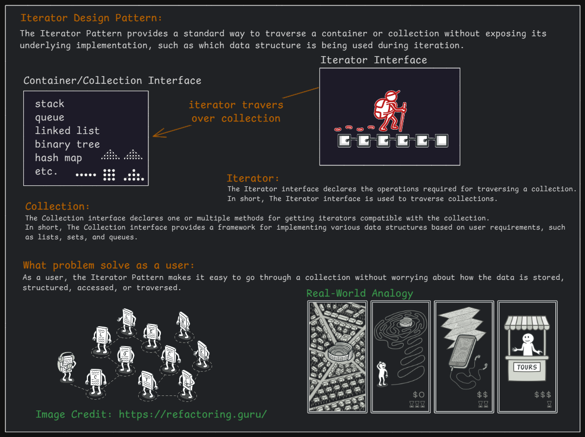
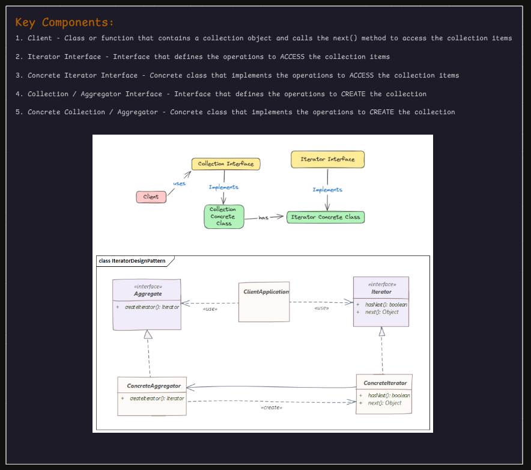

# 5. Iterator Design Pattern

1. What is It?
2. Where and Why do We Use It?
3. Key Components
4. Principle Method
5. Examples of Real-World Scenario
6. Code without Pattern
7. Code with Pattern
8. Use cases of
9. Advantages & Disadvantages
10. Conclusion

## 1. What is It?

The **Iterator Pattern** is a behavioral design pattern that allows sequential access to elements in a collection **without** exposing its internal details.

**In other words**, the **Iterator Pattern** is a design pattern used to **traverse** or **iterate** over a collection (like a list, array, or set) without exposing its internal structure. It provides a uniform way to access elements one by one.

<p align="center">
  
</p>

## 2. Where and Why Do We Use It?

### Where?

- When you need to traverse a collection (Array, List, Set, etc.).
- When you want to access elements **without modifying** the collection structure.
- When you need a **unified** way to traverse different data structures.

### Why?

- **Encapsulation:** The collection's internal structure remains hidden.
- **Flexibility:** Works with different types of collections.
- **Easy traversal:** No need to manage loop counters manually.

## 3. Key Components

<p align="center">
  
</p>

1. **Iterator Interface** → Defines methods like `hasNext()` and `next()`.
2. **Concrete Iterator** → Implements `Iterator` and provides actual iteration logic.
3. **Collection Interface** → Provides `createIterator()` method to return an iterator.
4. **Concrete Collection** → Implements `Collection` and holds data.

## 4. Principle Method

1. **hasNext():** Checks if more elements exist.
2. **next():** Returns the next element in the collection.
3. **remove() (optional):** Removes the current element.

## 5. Examples of Real-World Scenario

A **_YouTube Playlist_** contains multiple videos.

- You need a **next()** method to get the next video.
- You do not need to worry about the internal storage of the playlist.
- Iterator Pattern allows smooth navigation.

## 6. Code Without Pattern (Tightly Coupled Code)

```java
import java.util.ArrayList;
import java.util.List;

class Playlist {
    List<String> videos = new ArrayList<>();

    public void addVideo(String video) {
        videos.add(video);
    }

    public void playAll() {
        for (int i = 0; i < videos.size(); i++) {
            System.out.println("Playing: " + videos.get(i));
        }
    }
}

public class WithoutIterator {
    public static void main(String[] args) {
        Playlist playlist = new Playlist();
        playlist.addVideo("Video 1");
        playlist.addVideo("Video 2");
        playlist.addVideo("Video 3");

        playlist.playAll();  // Manually iterating
    }
}

/*
OUTPUT:
Playing: Video 1
Playing: Video 2
Playing: Video 3
*/
```

Problems:

- **Tightly coupled** with the internal list.
- Hard to change **iteration logic**.
- Not flexible for **different data structures**.

## 7. Code With Pattern (Flexible & Scalable)

```java
import java.util.ArrayList;
import java.util.List;

// Step 1: Iterator Interface
interface Iterator {
    boolean hasNext();
    String next();
}

// Step 2: Concrete Iterator Class
class VideoIterator implements Iterator {
    private List<String> videos;
    private int index = 0;

    public VideoIterator(List<String> videos) {
        this.videos = videos;
    }

    @Override
    public boolean hasNext() {
        return index < videos.size();
    }

    @Override
    public String next() {
        if (hasNext()) {
            return videos.get(index++);
        }
        return null;
    }
}

// Step 3: Collection Interface
interface PlaylistCollection {
    Iterator createIterator();
}

// Step 4: Concrete Collection Class
class Playlist implements PlaylistCollection {
    private List<String> videos = new ArrayList<>();

    public void addVideo(String video) {
        videos.add(video);
    }

    @Override
    public Iterator createIterator() {
        return new VideoIterator(videos);
    }
}

// Step 5: Client Code (Main Method)
public class WithIterator {
    public static void main(String[] args) {
        Playlist playlist = new Playlist();
        playlist.addVideo("Video 1");
        playlist.addVideo("Video 2");
        playlist.addVideo("Video 3");

        Iterator iterator = playlist.createIterator();

        while (iterator.hasNext()) {
            System.out.println("Playing: " + iterator.next());
        }
    }
}
```

### Check Code to Understand How the Iterator Pattern implemented using different data structures:

1. Array List
2. Linked List
3. Hash Set

Each data structure has its own **Concrete Collection** and **Concrete Iterator** while following the same **Iterator** and **Aggregate/Collection** interfaces.

```java
import java.util.*;

// Step 1: Iterator Interface
interface Iterator {
    boolean hasNext();
    String next();
}

// Step 2: Concrete Iterator for ArrayList
class ArrayListIterator implements Iterator {
    private List<String> videos;
    private int index = 0;

    public ArrayListIterator(List<String> videos) {
        this.videos = videos;
    }

    @Override
    public boolean hasNext() {
        return index < videos.size();
    }

    @Override
    public String next() {
        if (hasNext()) {
            return videos.get(index++);
        }
        return null;
    }
}

// Step 3: Concrete Iterator for LinkedList
class LinkedListIterator implements Iterator {
    private List<String> videos;
    private int index = 0;

    public LinkedListIterator(List<String> videos) {
        this.videos = videos;
    }

    @Override
    public boolean hasNext() {
        return index < videos.size();
    }

    @Override
    public String next() {
        if (hasNext()) {
            return videos.get(index++);
        }
        return null;
    }
}

// Step 4: Concrete Iterator for HashSet
class HashSetIterator implements Iterator {
    private java.util.Iterator<String> iterator;

    public HashSetIterator(Set<String> videos) {
        this.iterator = videos.iterator();
    }

    @Override
    public boolean hasNext() {
        return iterator.hasNext();
    }

    @Override
    public String next() {
        return iterator.hasNext() ? iterator.next() : null;
    }
}

// Step 5: Collection Interface (Aggregate)
interface PlaylistCollection {
    void addVideo(String video);
    Iterator createIterator();
}

// Step 6: Concrete Collection for ArrayList
class ArrayListPlaylist implements PlaylistCollection {
    private List<String> videos = new ArrayList<>();

    public void addVideo(String video) {
        videos.add(video);
    }

    @Override
    public Iterator createIterator() {
        return new ArrayListIterator(videos);
    }
}

// Step 7: Concrete Collection for LinkedList
class LinkedListPlaylist implements PlaylistCollection {
    private List<String> videos = new LinkedList<>();

    public void addVideo(String video) {
        videos.add(video);
    }

    @Override
    public Iterator createIterator() {
        return new LinkedListIterator(videos);
    }
}

// Step 8: Concrete Collection for HashSet
class HashSetPlaylist implements PlaylistCollection {
    private Set<String> videos = new HashSet<>();

    public void addVideo(String video) {
        videos.add(video);
    }

    @Override
    public Iterator createIterator() {
        return new HashSetIterator(videos);
    }
}

// Step 9: Client Code (Main Method)
public class WithIteratorDifferentDataStructure {
    public static void main(String[] args) {
        System.out.println("Using ArrayList:");
        PlaylistCollection arrayListPlaylist = new ArrayListPlaylist();
        arrayListPlaylist.addVideo("Video A");
        arrayListPlaylist.addVideo("Video B");
        arrayListPlaylist.addVideo("Video C");
        printPlaylist(arrayListPlaylist.createIterator());

        System.out.println("\nUsing LinkedList:");
        PlaylistCollection linkedListPlaylist = new LinkedListPlaylist();
        linkedListPlaylist.addVideo("Video X");
        linkedListPlaylist.addVideo("Video Y");
        linkedListPlaylist.addVideo("Video Z");
        printPlaylist(linkedListPlaylist.createIterator());

        System.out.println("\nUsing HashSet:");
        PlaylistCollection hashSetPlaylist = new HashSetPlaylist();
        hashSetPlaylist.addVideo("Video 1");
        hashSetPlaylist.addVideo("Video 2");
        hashSetPlaylist.addVideo("Video 3");
        printPlaylist(hashSetPlaylist.createIterator());
    }

    private static void printPlaylist(Iterator iterator) {
        while (iterator.hasNext()) {
            System.out.println("Playing: " + iterator.next());
        }
    }
}

/*
Using ArrayList:
Playing: Video A
Playing: Video B
Playing: Video C

Using LinkedList:
Playing: Video X
Playing: Video Y
Playing: Video Z

Using HashSet:
Playing: Video 2
Playing: Video 1
Playing: Video 3
*/
```

## 8. Use Cases of Iterator Pattern

- **Database Cursors:** Iterate over database records.
- **File Handling:** Reading lines from a file one by one.
- **Collections API:** Used in Java's List, Set, and Map.
- **Social Media Feeds:** Iterating over posts in Facebook, Twitter, etc.

## 9. Advantages & Disadvantages

### Advantages

- **Encapsulation** → Hides internal details of the collection.
- **Flexibility** → Works with any data structure.
- **Consistent Traversal** → Unified approach for different collections.

### Disadvantages

- **Extra Classes** → More code due to separate Iterator class.
- **Performance Overhead** → Extra method calls can slow down performance in large collections.

## Conclusion

The **Iterator Pattern** helps in smooth and consistent traversal over collections without exposing internal details. It is widely used in Java Collections (ArrayList, LinkedList, etc.) and makes iteration cleaner and more flexible.
