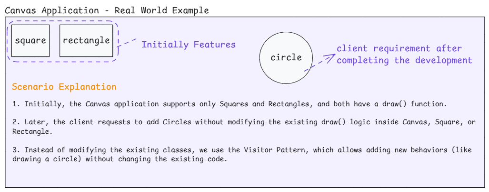
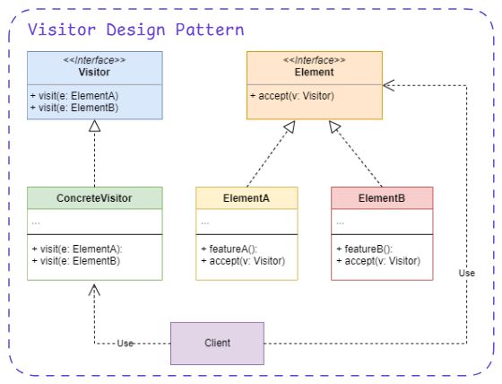

# 6. Visitor Design Pattern

1. What is It?
2. Where and Why do We Use It?
3. Key Components
4. Principle Method
5. Examples of Real-World Scenario
6. Code without Pattern
7. Code with Pattern
8. Use cases of
9. Advantages & Disadvantages
10. Conclusion
11. Interview Based Content

## 1. What is It?

The **Visitor Design Pattern** allows you to **add new operations** to existing objects **without modifying their structure**. Instead of changing the actual class, we create a separate visitor class that contains the new functionality.

<p align="center">
  
</p>

## 2. Where and Why Do We Use It?

- When we need to **perform multiple operations** on an object but don't want to modify the class.
- Helps in keeping **class responsibilities separate**.
- Useful when we want to **apply different behaviors** to objects of the same structure.
- Commonly used in **compilers, UI frameworks, and AST traversal**.

## 3. Key Components

<p align="center">
  
</p>

1. **Visitor Interface** → Defines operations to be performed.
2. **Concrete Visitor** → Implements different operations.
3. **Element Interface** → Defines an accept(Visitor visitor) method.
4. **Concrete Elements** → Objects that accept visitors.
5. **Client** → Uses visitors to operate on elements.

## 4. Principle Method

The **accept()** method in elements allows a visitor to perform an operation.

## 5. Examples of Real-World Scenario

- **Tax Calculation System** → Different types of employees (Full-time, Part-time) have different tax rates. Instead of modifying each employee class, a **TaxVisitor** can be created.
- **Shopping Cart System** → Different discount rules apply for different products, so a **DiscountVisitor** can calculate them.
- **AST (Abstract Syntax Tree) in Compilers** → The compiler visits each node to perform analysis and transformation.

## 6. Code Without Pattern (Tightly Coupled Code)

```java
// Base Employee class
abstract class Employee {
    String name;
    double salary;

    Employee(String name, double salary) {
        this.name = name;
        this.salary = salary;
    }

    abstract double calculateTax(); // Hardcoded tax logic in the class itself
}

// Full-time Employee
class FullTimeEmployee extends Employee {
    FullTimeEmployee(String name, double salary) {
        super(name, salary);
    }

    @Override
    double calculateTax() {
        return salary * 0.25; // Fixed 25% tax
    }
}

// Part-time Employee
class PartTimeEmployee extends Employee {
    PartTimeEmployee(String name, double salary) {
        super(name, salary);
    }

    @Override
    double calculateTax() {
        return salary * 0.15; // Fixed 15% tax
    }
}

// Client Code
public class WithoutVisitor {
    public static void main(String[] args) {
        Employee emp1 = new FullTimeEmployee("Rahul", 50000);
        Employee emp2 = new PartTimeEmployee("Amit", 50000);

        System.out.println(emp1.name + " Tax: " + emp1.calculateTax()); // Rahul Tax: 12500.0
        System.out.println(emp2.name + " Tax: " + emp2.calculateTax()); // Amit Tax: 7500.0
    }
}
```

Problems in This Approach

- If we need another operation (like bonus calculation), we must modify the **Employee** class.
- Breaks **Open/Closed Principle** (modifying existing classes for new operations).
- Tightly coupled logic.

## 7. Code With Pattern (Flexible & Scalable)

```java
import java.util.ArrayList;
import java.util.List;

// Step 1: Visitor Interface
interface Visitor {
    void visit(FullTimeEmployee employee);
    void visit(PartTimeEmployee employee);
}

// Step 2: Concrete Visitor for Tax Calculation
class TaxVisitor implements Visitor {
    @Override
    public void visit(FullTimeEmployee employee) {
        System.out.println(employee.name + " Tax: " + (employee.salary * 0.25));
    }

    @Override
    public void visit(PartTimeEmployee employee) {
        System.out.println(employee.name + " Tax: " + (employee.salary * 0.15));
    }
}

// Todo 1: New Concrete Visitor for Bonus Calculation
class BonusVisitor implements Visitor {
    @Override
    public void visit(FullTimeEmployee employee) {
        System.out.println(employee.name + " Bonus: " + (employee.salary * 0.10));
    }

    @Override
    public void visit(PartTimeEmployee employee) {
        System.out.println(employee.name + " Bonus: " + (employee.salary * 0.05));
    }
}


// Step 3: Element Interface
interface Employee {
    void accept(Visitor visitor);
}

// Step 4: Concrete Elements
class FullTimeEmployee implements Employee {
    String name;
    double salary;

    FullTimeEmployee(String name, double salary) {
        this.name = name;
        this.salary = salary;
    }

    @Override
    public void accept(Visitor visitor) {
        visitor.visit(this);
    }
}

class PartTimeEmployee implements Employee {
    String name;
    double salary;

    PartTimeEmployee(String name, double salary) {
        this.name = name;
        this.salary = salary;
    }

    @Override
    public void accept(Visitor visitor) {
        visitor.visit(this);
    }
}

// Step 5: Client Code
public class WithVisitor {
    public static void main(String[] args) {
        List<Employee> employees = new ArrayList<>();
        employees.add(new FullTimeEmployee("Rahul", 50000)); // Rahul Tax: 12500.0
        employees.add(new PartTimeEmployee("Amit", 50000)); // Amit Tax: 7500.0

        Visitor taxVisitor = new TaxVisitor();

        for (Employee emp : employees) {
            emp.accept(taxVisitor);
        }

        // Todo 1: New Bonus Calculation
        System.out.println("\nCalculating Bonuses:");
        Visitor bonusVisitor = new BonusVisitor();
        for (Employee emp : employees) {
            emp.accept(bonusVisitor);
        }
    }
}

/*
Final Output:
Rahul Tax: 12500.0
Amit Tax: 7500.0

Calculating Bonuses:
Rahul Bonus: 5000.0
Amit Bonus: 2500.0
*/
```

### Why Is This Better?

1. **Open/Closed Principle:** Can add new visitors (like BonusCalculator/BonusVisitor) without modifying existing Employee classes.
2. **Separation of Concerns:** Employee class doesn’t contain tax logic.

`Todo 1:` Create the BonusVisitor Class

```java
// Todo 1: New Concrete Visitor for Bonus Calculation
class BonusVisitor implements Visitor {
    @Override
    public void visit(FullTimeEmployee employee) {
        System.out.println(employee.name + " Bonus: " + (employee.salary * 0.10));
    }

    @Override
    public void visit(PartTimeEmployee employee) {
        System.out.println(employee.name + " Bonus: " + (employee.salary * 0.05));
    }
}
```

`Todo 2:` Use BonusVisitor in the Client Code

```java
// Step 5: Client Code
public class WithVisitor {
    public static void main(String[] args) {
        ....

        // Todo 1: New Bonus Calculation
        System.out.println("\nCalculating Bonuses:");
        Visitor bonusVisitor = new BonusVisitor();
        for (Employee emp : employees) {
            emp.accept(bonusVisitor);
        }
    }
}
```

## 8. Use Cases of Visitor Pattern

1. **Compilers** → AST traversal (syntax tree processing).
2. **File Systems** → Different operations (indexing, compression) on files and folders.
3. **Game Development** → Applying different behaviors to game characters dynamically.
4. **Banking** → Calculating interest rates for different account types.

## 9. Advantages & Disadvantages

### Advantages

1. **New Operations Without Modifying Existing Classes** – Makes the system more flexible.
2. **Separates Logic from Objects** – Object class doesn't handle operations like tax calculation.
3. **Works Well With Complex Object Structures** – Can visit different types of objects.

### Disadvantages

1. **Not Useful for Small Systems** – Adds complexity if only one operation is needed.
2. **Breaks Encapsulation** – Visitors might access private data of elements.
3. **Difficult to Modify Elements** – If element hierarchy changes, all visitors must be updated.

## 10. Conclusion

The Visitor Pattern is useful when you need to perform multiple operations on different object types without modifying their structure. It follows the Open/Closed Principle and is widely used in compilers, UI frameworks, and financial applications. However, it should be used only when multiple operations need to be performed on an object structure, as it adds extra complexity.

# 11. Interview Based Content

## What is Double Dispatch?

**Double Dispatch** is a programming concept where **the method that gets executed is determined by the runtime types of two objects** instead of just one.
In **single dispatch** (which Java normally follows), method execution is determined by the **runtime type of the calling object**.
But in **double dispatch**, method execution depends on **both the calling object and the type of argument passed**.

## Why Understand Double Dispatch Before the Visitor Pattern?

The **Visitor Design** Pattern relies on **double dispatch** to work.

- The **first dispatch** happens when we call `accept(visitor)` on an element.
- The **second dispatch** happens when the visitor calls `visit(this)` inside `accept()`, ensuring that the correct `visit()` method executes based on the object type.

Since **Visitor Pattern separates operations from object structures, double dispatch ensures the correct method runs for each object type** without modifying the object itself.

## Example: Single Dispatch (Normal Method Overriding in Java)

```java
class Animal {
    void makeSound() {
        System.out.println("Animal makes a sound");
    }
}

class Dog extends Animal {
    @Override
    void makeSound() {
        System.out.println("Dog barks");
    }
}

public class SingleDispatch {
    public static void main(String[] args) {
        Animal myPet = new Dog();
        myPet.makeSound(); // Calls Dog's makeSound() (Single Dispatch)
    }
}
```

### How It Works:

- `myPet.makeSound();` calls **Dog's** overridden method because `makeSound()` is resolved based on **runtime type of `myPet`**.
- This is **single dispatch** because the method is determined only by **one** object type **(Dog)**.

## Example: Double Dispatch (How Visitor Pattern Works Internally)

```java
// Step 1: Element Interface
interface Animal {
    void accept(Visitor visitor);
}

// Step 2: Concrete Elements
class Dog implements Animal {
    @Override
    public void accept(Visitor visitor) {
        visitor.visit(this); // First Dispatch
    }
}

class Cat implements Animal {
    @Override
    public void accept(Visitor visitor) {
        visitor.visit(this); // First Dispatch
    }
}

// Step 3: Visitor Interface
interface Visitor {
    void visit(Dog dog);
    void visit(Cat cat);
}

// Step 4: Concrete Visitor
class SoundVisitor implements Visitor {
    @Override
    public void visit(Dog dog) {
        System.out.println("Dog barks"); // Second Dispatch
    }

    @Override
    public void visit(Cat cat) {
        System.out.println("Cat meows"); // Second Dispatch
    }
}

// Step 5: Client Code
public class DoubleDispatch {
    public static void main(String[] args) {
        Animal dog = new Dog();
        Animal cat = new Cat();
        Visitor soundVisitor = new SoundVisitor();

        dog.accept(soundVisitor); // First dispatch (Dog -> accept()), Second dispatch (Visitor -> visit(Dog))
        cat.accept(soundVisitor); // First dispatch (Cat -> accept()), Second dispatch (Visitor -> visit(Cat))
    }
}
```

### How It Works in Double Dispatch

- `dog.accept(soundVisitor);` → Calls Dog's accept() method (First Dispatch).
- Inside `accept()`, `visitor.visit(this);` executes → Calls **SoundVisitor's** `visit(Dog dog)` method (**Second Dispatch**).
- Correct method runs based on both **object type (Dog)** and visitor type **(SoundVisitor)**.

## How Double Dispatch Helps in the Visitor Pattern

- It **ensures the correct visit() method is executed** for each object type dynamically.
- Without **double dispatch**, the visitor would need **complex if-else or instanceof checks**, making the code harder to maintain.
- **Visitor Pattern heavily relies on double dispatch** to separate object structure from operations.

## "Initially, canvas has include the draw function to draw the square and rectangle only" but after completing the application a client need to draw the circle - so this problem can solved by Visitor Pattern.

<p align="center">
  
</p>

### How Visitor Pattern Solves This Issue

- We define an **interface Shape** with an `accept(Visitor visitor)` method.
- **Concrete shapes** (Square, Rectangle, Circle) implement `accept()` and call the appropriate `visit()` method of the visitor.
- The DrawingVisitor (visitor class) contains logic for drawing each shape.
- When a new shape like Circle is added, we only modify the visitor, keeping existing shape classes unchanged.

```java
// Step 1: Element Interface
interface Shape {
    void accept(DrawingVisitor visitor);
}

// Step 2: Concrete Elements (Shapes)
class Square implements Shape {
    @Override
    public void accept(DrawingVisitor visitor) {
        visitor.visit(this); // First Dispatch
    }
}

class Rectangle implements Shape {
    @Override
    public void accept(DrawingVisitor visitor) {
        visitor.visit(this); // First Dispatch
    }
}

// Step 3: Visitor Interface
interface DrawingVisitor {
    void visit(Square square);
    void visit(Rectangle rectangle);
}


// Step 4: Concrete Visitor (Drawing Implementation)
class CanvasDrawingVisitor implements DrawingVisitor {
    @Override
    public void visit(Square square) {
        System.out.println("Drawing a Square");
    }

    @Override
    public void visit(Rectangle rectangle) {
        System.out.println("Drawing a Rectangle");
    }
}


// Step 5: Client Code
public class VisitorPatternCanvas {
    public static void main(String[] args) {
        Shape square = new Square();
        Shape rectangle = new Rectangle();
        DrawingVisitor visitor = new CanvasDrawingVisitor();

        square.accept(visitor); // First Dispatch (Square -> accept()), Second Dispatch (Visitor -> visit(Square))
        rectangle.accept(visitor);
    }
}
```

### Now, Adding Circle Without Changing Existing Shapes

- **Without the Visitor Pattern**, we would have to modify the Shape interface and all existing shape classes.
- **With the Visitor Pattern**, we **only** add a new Circle class and update the visitor.

```java
// Step 1: Element Interface
interface Shape {
    void accept(DrawingVisitor visitor);
}

// Step 2: Concrete Elements (Shapes)
class Square implements Shape {
    @Override
    public void accept(DrawingVisitor visitor) {
        visitor.visit(this); // First Dispatch
    }
}

class Rectangle implements Shape {
    @Override
    public void accept(DrawingVisitor visitor) {
        visitor.visit(this); // First Dispatch
    }
}

// Todo 1: New Shape: Circle
class Circle implements Shape {
    @Override
    public void accept(DrawingVisitor visitor) {
        visitor.visit(this); // First Dispatch
    }
}

// Step 3: Visitor Interface
interface DrawingVisitor {
    void visit(Square square);
    void visit(Rectangle rectangle);
    void visit(Circle circle); // Todo 2: Update Visitor Interface -> New Method for Circle
}


// Step 4: Concrete Visitor (Drawing Implementation)
class CanvasDrawingVisitor implements DrawingVisitor {
    @Override
    public void visit(Square square) {
        System.out.println("Drawing a Square");
    }

    @Override
    public void visit(Rectangle rectangle) {
        System.out.println("Drawing a Rectangle");
    }

    @Override
    public void visit(Circle circle) {
        System.out.println("Drawing a Circle"); // Todo 3: Update Concrete Visitor -> Added new behavior without modifying old shapes
    }
}


// Step 5: Client Code
public class VisitorPatternCanvas {
    public static void main(String[] args) {
        Shape square = new Square();
        Shape rectangle = new Rectangle();
        Shape circle = new Circle(); // Todo 4: New shape added
        DrawingVisitor visitor = new CanvasDrawingVisitor();

        square.accept(visitor); // First Dispatch (Square -> accept()), Second Dispatch (Visitor -> visit(Square))
        rectangle.accept(visitor);
        circle.accept(visitor); // Todo 4: Works without modifying old code
    }
}
```
