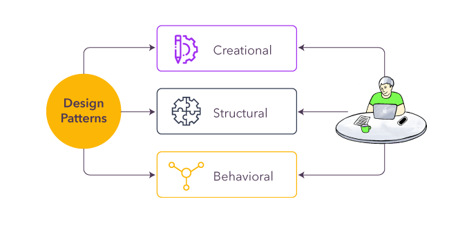

# What are Design Patterns?

Design patterns are like **tried-and-tested** solutions to common problems in software development. Imagine you face the same type of problem while coding again and again. Instead of solving it from scratch every time, **design patterns give you a reusable template** to solve it in the best way possible. They are not actual code but ideas and guidelines that help make your code **clean, organized, and efficient**.

  

## Why Learn Design Patterns?

1. **Write Better Code:** Design patterns help you write code that is easy to understand, maintain, and reuse.

2. **Save Time:** Instead of reinventing the wheel, you can use these tried methods to solve problems faster.

3. **Improve Teamwork:** When everyone in a team knows design patterns, they can communicate better using common terms like "Singleton" or "Observer."

4. **Handle Complexity:** Big projects can become messy. Design patterns help you manage complexity and avoid mistakes.

5. **Boost Skills:** Learning design patterns makes you a better developer and prepares you for real-world software challenges.

## Types of Software Design Patterns

There are three main categories of design patterns:
    
    1. Creational Patterns
        ○ These are about how objects are created in a project.
        ○ Example: Instead of creating objects directly, use methods to create them in a flexible and organized way.
        ○ Popular Patterns:
            § Singleton: Ensures only one instance of a class exists.
            § Factory: Helps create objects without specifying their exact class.

    2. Structural Patterns
        ○ These deal with how different parts of your code work together.
        ○ Example: Think of it like building blocks arranged in a clear and efficient structure.
        ○ Popular Patterns:
            § Adapter: Connects two incompatible parts of your code.
            § Decorator: Adds new features to an existing object without changing it.

    3. Behavioral Patterns
        ○ These are about how objects communicate and share responsibility.
        ○ Example: Helping objects work together in a smart way.
        ○ Popular Patterns:
            § Observer: One object reacts when another changes.
            § Strategy: Switch between different methods or algorithms easily.

By learning and applying design patterns, you'll write software that's not only functional but also robust, scalable, and easier to maintain.
